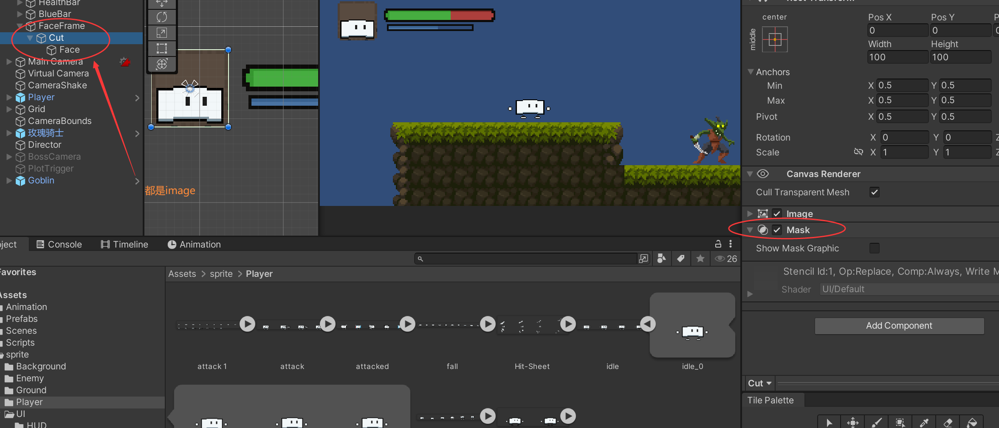
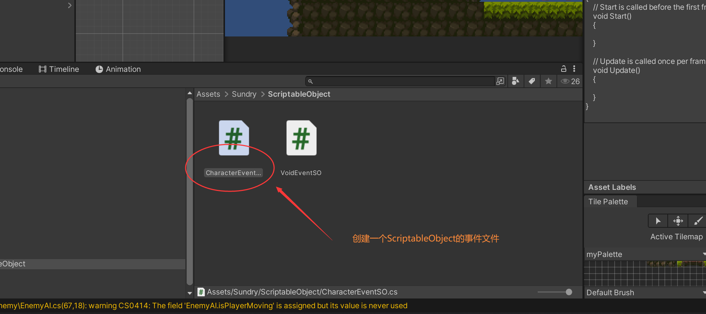
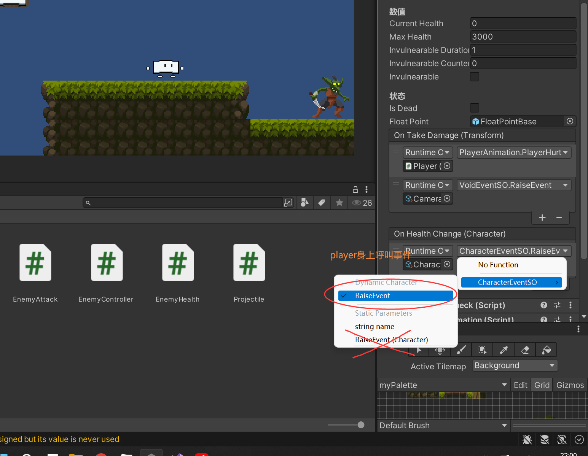

```c#
using System.Collections;
using System.Collections.Generic;
using UnityEngine;
using UnityEngine.Events;


//把这个ScriptableObject理解成一个事件，ScriptableObject类型的事件
[CreateAssetMenu(menuName = "Event/CharacterEventSO")]
public class CharacterEventSO : ScriptableObject
{
    //事件需要订阅方法
    //暂时把这个看成真正的事件
    public UnityAction<Character> OnEventRaised;

    //谁要启动事件，就把参数传进去
    public void RaiseEvent(Character charater)
    {
        OnEventRaised?.Invoke(charater);
    }
}

```

```c#

public class Character : MonoBehaviour
{

    public UnityEvent<Character> OnHealthChange; 


}

```



```c#

public class Character : MonoBehaviour
{

    void Start()
    {
        OnHealthChange?.Invoke(this);
    }


    public void TakeDamage(Attack attacker)
    {
        //执行事件,加个问号代表询问列表有没有函数
        OnHealthChange?.Invoke(this);
    }

}

```


```c#
public class UIManager : MonoBehaviour
{
    public PlayerStatBar playerStatBar;
    
    [Header("事件监听")]
    public CharacterEventSO healthEvent; //通过这个事件，成功的给UIManager传递了信息

    //注册事件，给事件添加函数
    private void OnEnable()
    {
        healthEvent.OnEventRaised += OnHealthEvent;
    }

    //注销事件
    private void OnDisable()
    {
        healthEvent.OnEventRaised -= OnHealthEvent;
    }

    private void OnHealthEvent(Character character)
    {
         var persentage =  (float)character.currentHealth / character.maxHealth;
        playerStatBar.OnHealthChange(persentage);
    }

}
```


```c#
public class PlayerStatBar : MonoBehaviour
{
    public Image healthImage;
    public Image healthDelayImage;
    public Image BlueImage;

    private void Update()
    {
        //血条缓冲效果
        if(healthDelayImage.fillAmount > healthImage.fillAmount)
        {
            healthDelayImage.fillAmount -= Time.deltaTime * 0.1f;
        }
    }

    public void OnHealthChange(float persentage)
    {
        healthImage.fillAmount = persentage; 
    }
}
```


