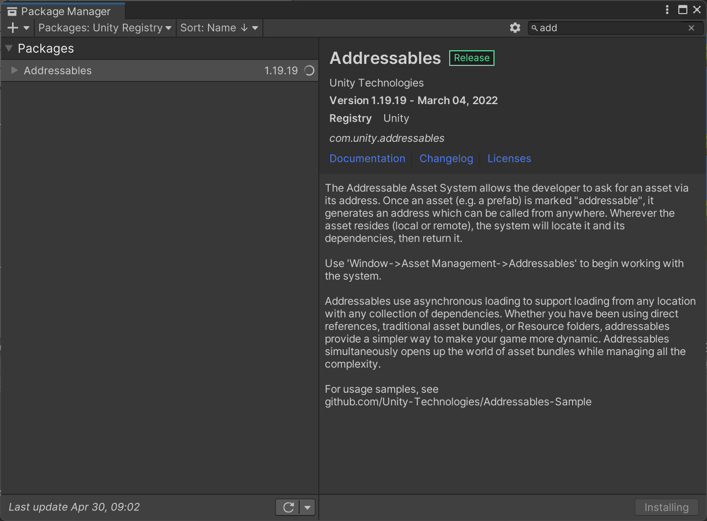
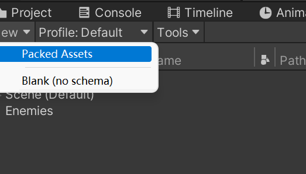
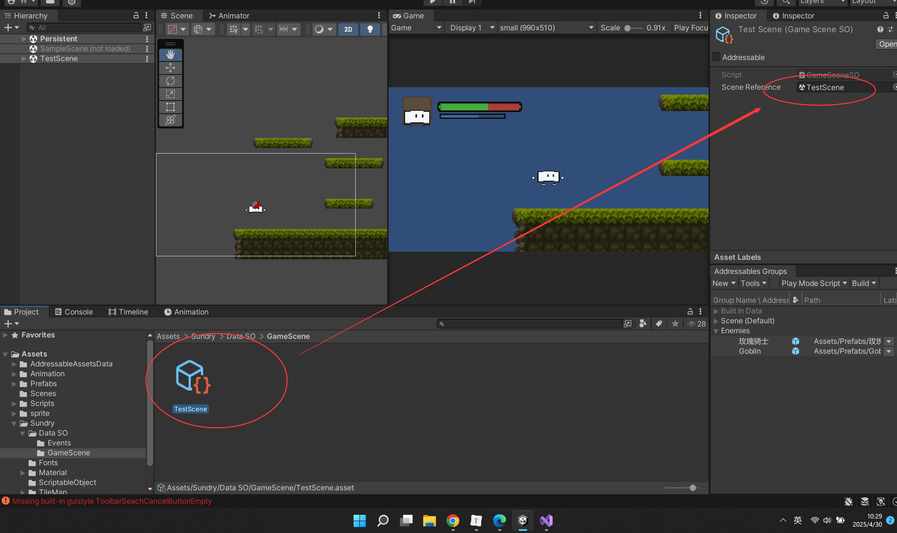

让包体变小，不会重复的打包包体内的东西





```c#
using UnityEngine;


[CreateAssetMenu(menuName = "Event/SceneLoadEventSO"))]
public class SceneLoadEventSO: ScriptableObject
{

}
```

```c#
using System.Collections;
using System.Collections.Generic;
using UnityEngine;

//addressable场景信息
[CreateAssetMenu(menuName = "GameScene/GameSceneSO")]
public class GameSceneSO : ScriptableObject
{
    public AssetReference sceneReference;
}

```




创建第一个场景

```c#
public class SceneLoad : MonoBehaviour
{
    //第一个场景，的信息
    public GameSceneSO firstLoadScene;

    private void Awake()
    {
        //异步加载场景
        //从SO里获取场景的引用
        Addressables.LoadSceneAsync(firstLoadScene.sceneReference,LoadSceneMode.Additive);
    }
}
```


```c#
public enum SceneType
{
    //用于指定场景的类型，有可能是纯UI的场景
    Location, Menu
}
```

事件SO创建

```c#

using UnityEngine;
using UnityEngine.Events;

[CreateAssetMenu(menuName = "Event/SceneLoadEventSO")]
public class SceneLoadEventSO: ScriptableObject
{
    //场景切换的事件主体
    public UnityAction<GameSceneSO, Vector3, bool> loadRequestEvent;

    public void RaiseLoadRequestEvent(GameSceneSO locationToLoad, Vector3 posToGo, bool fadeScreen)
    {
        loadRequestEvent?.Invoke(locationToLoad, posToGo, fadeScreen);  
    }
}
```

在Teleport事件呼叫

```c#

public class Teleport : MonoBehaviour, IInteractable
{
    public GameSceneSO sceneToGo; //  去往的场景
    public Vector3 positionToGo;//去往场景的坐标
    public SceneLoadEventSO loadEventSO; //事件SO

    public void TriggerAction()
    {
        print("传送");
        loadEventSO.RaiseLoadRequestEvent(sceneToGo, positionToGo, true); // 事件呼叫
    }
}

```

在SceneManager上监听

````c#

public class SceneLoad : MonoBehaviour
{
    //第一个场景，的信息
    public GameSceneSO firstLoadScene;
    private GameSceneSO currentLoadScene;


    public SceneLoadEventSO sceneLoadEventSO;

    //下个场景
    private GameSceneSO locationToGo;
    private Vector3 posToGo;
    private bool fadeScreen;
    private float fadeTime; //淡入淡出的时间

    private void Awake()
    {
        ////异步加载场景
        ////从SO里获取场景的引用
        //Addressables.LoadSceneAsync(firstLoadScene.sceneReference,LoadSceneMode.Additive);有点问题先不这么用
        currentLoadScene = firstLoadScene;
        firstLoadScene.sceneReference.LoadSceneAsync(LoadSceneMode.Additive);

    }

    private void OnEnable()
    {
        sceneLoadEventSO.loadRequestEvent += OnLoadRequestEvent;
    }

    private void OnDisable()
    {
        sceneLoadEventSO.loadRequestEvent -= OnLoadRequestEvent; 
    }

    private void OnLoadRequestEvent(GameSceneSO _locationToGo, Vector3 _posToGo, bool _fadeScreen)
    {
        locationToGo = _locationToGo;
        posToGo = _posToGo;
        fadeScreen = _fadeScreen;

        StartCoroutine(UnloadPreviousScene());
    }

    //卸载场景
    private IEnumerator UnloadPreviousScene()
    {
        if (fadeScreen)
        {
            // Todd
        }

        yield return new WaitForSeconds(fadeTime);

        yield return currentLoadScene.sceneReference.UnLoadScene();

        LoadNewScene();
    }

    //加载场景
    private void LoadNewScene()
    {
        locationToGo.sceneReference.LoadSceneAsync(LoadSceneMode.Additive, true);
    }

}

````

