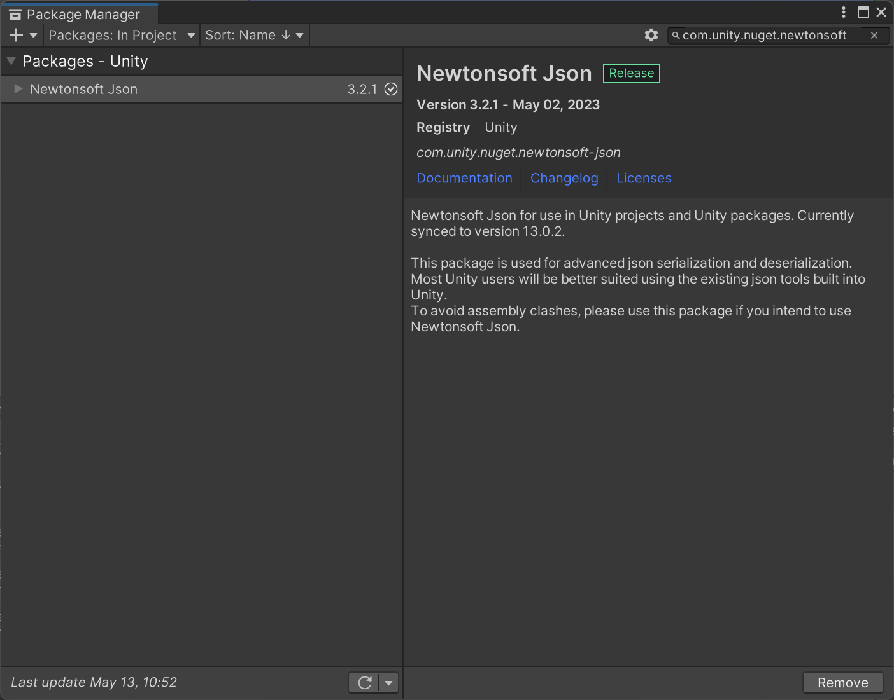

com.unity.nuget.newtonsoft-json




```c#
using Newtonsoft.Json;
using System.IO;

//保证在加载之前读取进度
[DefaultExecutionOrder(-100)]

public class DataManager : MonoBehaviour
{

    //持久化
    private string jsonFolder;

    private void Awake()
    {	
        jsonFolder = Application.persistentDataPath + "/SAVE_DATA/";
        print(Application.persistentDataPath);

        ReadSaveData();
    }


    //存档
    public void Save()
    {
		...
        var resultPath = jsonFolder + "data.sav";
        //将数据转成json文件
        var jsonData = JsonConvert.SerializeObject(data);
        //创建路径
        if(!File.Exists(resultPath))
            Directory.CreateDirectory(jsonFolder); //路径
        File.WriteAllText(resultPath, jsonData);

    }

    //读档
    public void Load()
    {
        ReadSaveData();
        foreach (var item in saveableList)
        {
            item.LoadData(data);
        }

    }

    private void ReadSaveData()
    {
        var resultPath = jsonFolder + "data.sav";

        if (File.Exists(resultPath))
        {
            //将json转成Class.Data
            var stringData = File.ReadAllText(resultPath);
            var jsonData = JsonConvert.DeserializeObject<Data>(stringData);
            data = jsonData;
        }
    }

}

```


```c#

public class Data
{
    //用字典的方式记录物体位置
    public Dictionary<string, SerlializeVector3> characterPosDict = new Dictionary<string, SerlializeVector3>();

}

public class SerlializeVector3
{
    public float x, y, z;

    public SerlializeVector3(Vector3 pos)
    {
        this.x = pos.x;
        this.y = pos.y;
        this.z = pos.z;
    }

    public Vector3 ToVector3()
    {
        return new Vector3(x, y, z);   
    }
}
```


具体的数据点

```c#

public class Character : MonoBehaviour, ISaveable
{

    public void SaveData(Data data)
    {
        //print(GetDataID());
        if (data.characterPosDict.ContainsKey(GetDataID().ID))
        {
            data.characterPosDict[GetDataID().ID] = new SerlializeVector3(transform.position);
        }
        else
        {
            data.characterPosDict.Add(GetDataID().ID, new SerlializeVector3(transform.position));
        }
    }

    public void LoadData(Data data)
    {
        if (data.characterPosDict.ContainsKey(GetDataID().ID))
        {
            transform.position = data.characterPosDict[GetDataID().ID].ToVector3();
        }
    }
}

```


```c#

public class SceneLoad : MonoBehaviour, ISaveable
{
    public void LoadData(Data data)
    {
        if (data.characterPosDict.ContainsKey(playerID))
        {
            var playerPos = data.characterPosDict[playerID].ToVector3();
        }
    }
}

```

