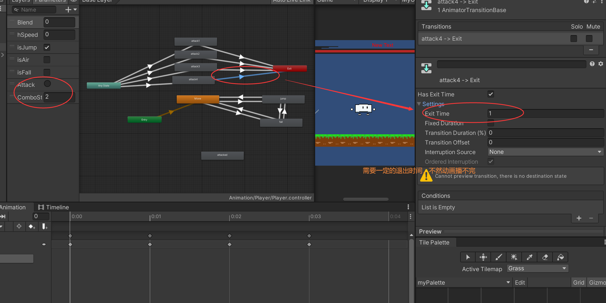
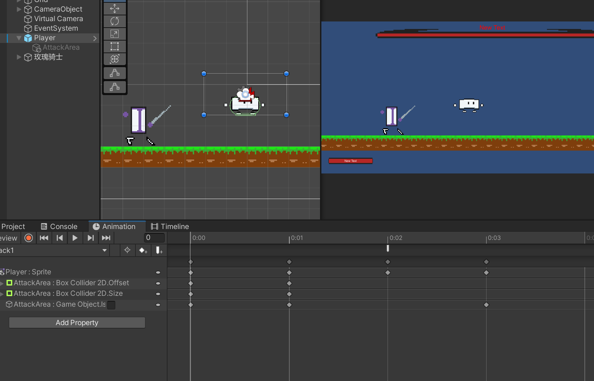

```c#
    private int comboStep;
    public float interval = 0.1f;
    private float timer;
    private bool isAttack = false;
   //攻击
    void Attack()
    {
        if (Input.GetButtonDown("Attack") && !isAttack)
        {
            isAttack = true;
            comboStep++;
            if (comboStep > 4) comboStep = 1;
            timer = interval;
            anim.SetTrigger("Attack");
            anim.SetInteger("ComboStep", comboStep);
            //print(44);
        }

        if(timer != 0)
        {
            timer -= Time.deltaTime;
            if(timer < 0f)
            {
                timer = 0f;
                comboStep = 0;
            }
        }
    }

    public void AttackOver()
    {
        isAttack = false;
    }
```



可以只需要创建一个碰撞体就可以了，通过动画事件来修改大小以及伤害