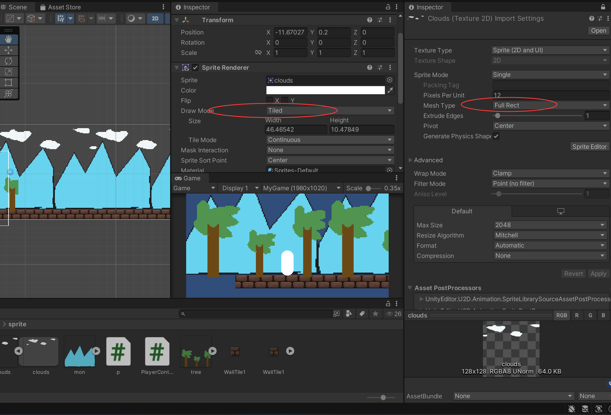

```c#
using System.Collections;
using System.Collections.Generic;
using System.Numerics;
using UnityEngine;
using Vector2 = UnityEngine.Vector2;
using Vector3 = UnityEngine.Vector3;
//using Vector3 = UnityEngine.Vector3;

public class p : MonoBehaviour
{
    [SerializeField]
    private Vector2 parallaxEffectMultiplier;
    private Transform cameraTransform;
    private Vector3 lastCameraPostion;
    private float textureUnitSizeX;


//┌───────────────────┐        ┌───────────────────────┐
//│    Texture.width   │                          │  Sprite.pixelsPerUnit  │
//│ (纹理原始像素宽度) │                          │ (每单位Unity单位对应像素数) │
//└─────────┬─────────┘        └────────────┬──────────┘
//                    │                                │
//          └──────────────┬─────────────────┘
//                                        │
                //                  textureUnitSizeX
                //              (纹理在游戏世界中的 X 轴单位长度)

    void Start()
    {
        cameraTransform = Camera.main.transform;
        lastCameraPostion = cameraTransform.position;
        Sprite sprite = GetComponent<SpriteRenderer>().sprite;
        Texture2D texture = sprite.texture; //获取原始图片的像素
        textureUnitSizeX = texture.width / sprite.pixelsPerUnit; //这个图片在unity中的大小
    }

    // Update is called once per frame
    void FixedUpdate()
    {
        Vector3 deltaMovement = cameraTransform.position - lastCameraPostion;
        //float parallaxEffectMultiplier = .5f;
        transform.position += 
        new Vector3(deltaMovement.x * parallaxEffectMultiplier.x, deltaMovement.y * parallaxEffectMultiplier.y, 0);
        lastCameraPostion = cameraTransform.position;

        if(Mathf.Abs(cameraTransform.position.x - transform.position.x) >= textureUnitSizeX)
        {
            //偏移量
            float offsetPositionX = (cameraTransform.position.x - transform.position.x) % textureUnitSizeX;


            transform.position = new Vector3(cameraTransform.position.x + offsetPositionX, transform.position.y);
        }

    }
}

```

