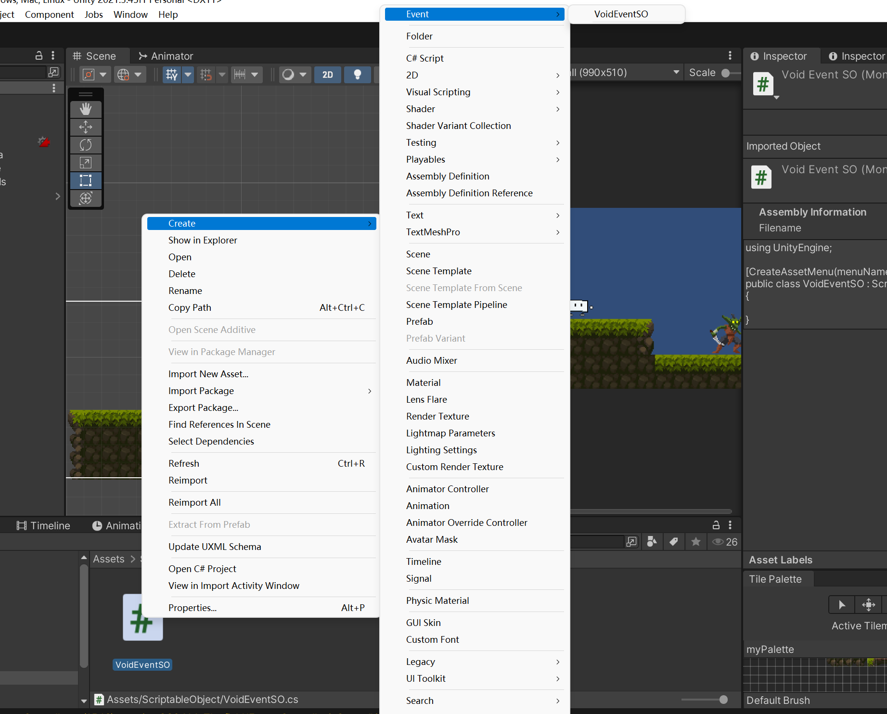

```c#
using UnityEngine;

//让菜单有这个选项
[CreateAssetMenu(menuName = "Event/VoidEventSO")]
public class VoidEventSO : ScriptableObject
{

}
```


```c#
public class CameraControl : MonoBehaviour
{
    private CinemachineConfiner2D confiner;
    public CinemachineImpulseSource impulseSource;
    public VoidEventSO cameraShakeEvent;

    private void Awake()
    {
        confiner = GetComponent<CinemachineConfiner2D>();
    }

    private void Start()
    {
        GetCameraBounds();
    }

    private void OnEnable()
    {
        cameraShakeEvent.OnEventRaised += OnCameraShakeEvent;
    }

    private void OnDisable()
    {
        cameraShakeEvent.OnEventRaised -= OnCameraShakeEvent;
    }

    private void OnCameraShakeEvent()
    {
        impulseSource.GenerateImpulse();
    }

    //换场景自动获取限制
    private void GetCameraBounds()
    {
        var obj = GameObject.FindGameObjectWithTag("Bounds");
        if (obj != null)
        {
            confiner.m_BoundingShape2D = obj.GetComponent<Collider2D>();

            confiner.InvalidateCache(); //清缓存
        }
    }
}

```

暂时理解为impulseSource.GenerateImpulse()可以让屏幕震动，然后通过一些手段封装成一种无参的事件VoidEventSO；