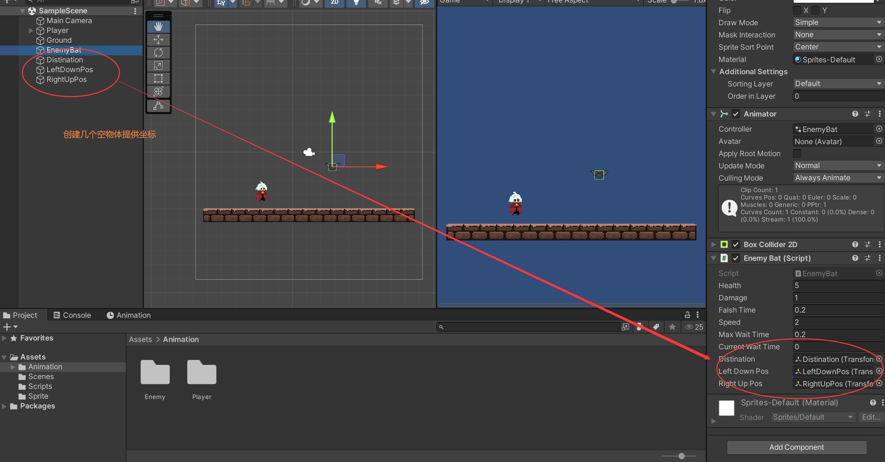

### 简单敌人AI功能 Enemy AI


```c#

public class EnemyBat : Enemy
{
    [SerializeField]
    private float speed = 2f;
    [SerializeField]
    private float maxWaitTime = 0.2f;
    [SerializeField]
    private float currentWaitTime;

    [SerializeField]
    private Transform distination;
    [SerializeField]
    private Transform leftDownPos;
    [SerializeField]
    private Transform rightUpPos;

    private float eps = 0.2f;


    public void Start()
    {
		...
        currentWaitTime = maxWaitTime;
        distination.position = GetRandomPos();
    }

    //获取一个随机位置
    private Vector2 GetRandomPos()
    {
        Vector2 rendomPos = new Vector2(Random.Range(leftDownPos.position.x, rightUpPos.position.x), Random.Range(leftDownPos.position.y, rightUpPos.position.y));

        return rendomPos;
    }

    //进行随机移动
    private void AiMove()
    {
        transform.position = Vector2.MoveTowards(transform.position, distination.position, Time.deltaTime * speed);

        if(Vector2.Distance(transform.position, distination.position) < eps)
        {
            if(currentWaitTime <= 0f)
            {
                distination.position = GetRandomPos();
                currentWaitTime = maxWaitTime;
            }
            else
            {
                currentWaitTime -= Time.deltaTime;
            }

        }
        
    }


     public void Update()
    {
		...
        AiMove();
    }
}

```




