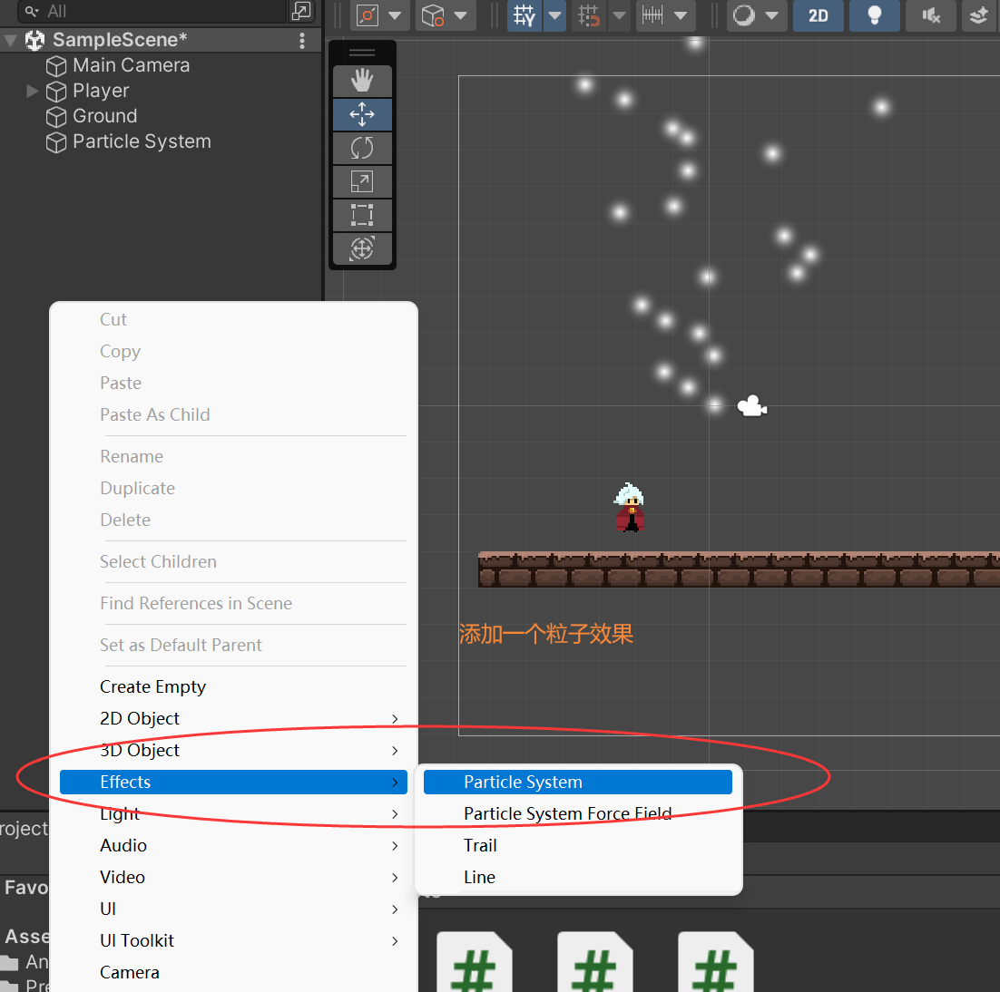

### 实现敌人掉血的粒子特效 Enemy Blood Effect





```c#

public class BloodEffect : MonoBehaviour
{
    [SerializeField]
    private float timeToDestroy = 1f;

    void Start()
    {
        //经过timeToDestroy删除粒子
        Destroy(gameObject, timeToDestroy);
    }
	...
}

```

```c#

public abstract class Enemy : MonoBehaviour
{
	...
    [SerializeField]
    private GameObject bloodEffect;

    public void Takedamage(int damage)
    {
		...
        //第三个参数是表示初始设置，不需要旋转
        Instantiate(bloodEffect, transform.position, Quaternion.identity);
    }

}

```

