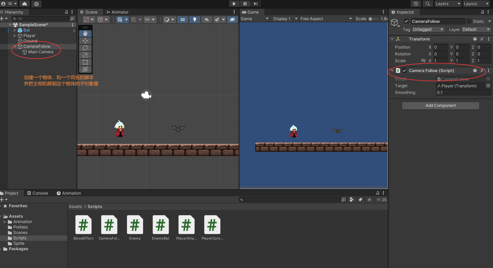

### 相机跟随Player功能 Camera Follow




```c#

public class CameraFollow : MonoBehaviour
{
    public Transform Target;
    public float smoothing = 0.1f;

    private void FixedUpdate()
    {
        if(Target != null)
        {
            Vector3 targetPos = Target.position;
            targetPos.z = -1;
            if (transform.position != targetPos)
            {
                transform.position = Vector3.Lerp(transform.position, targetPos, smoothing);
            }

        }
    }
}

```

