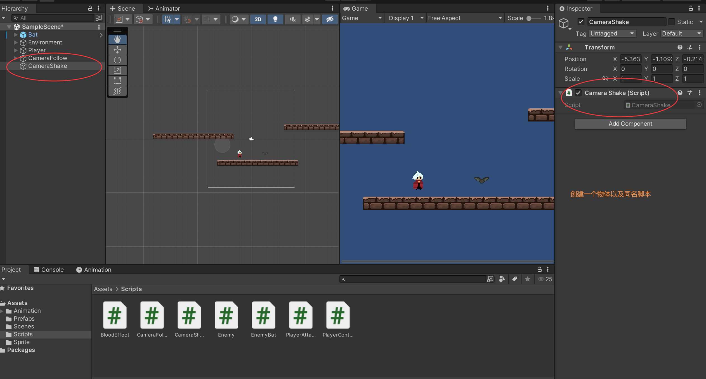
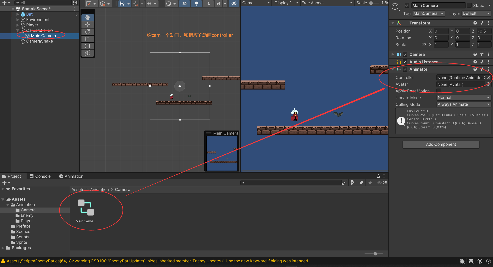
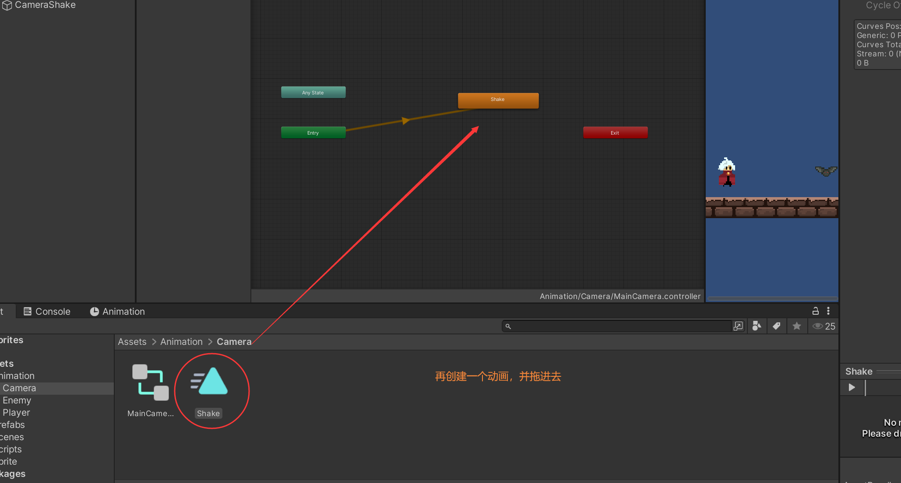
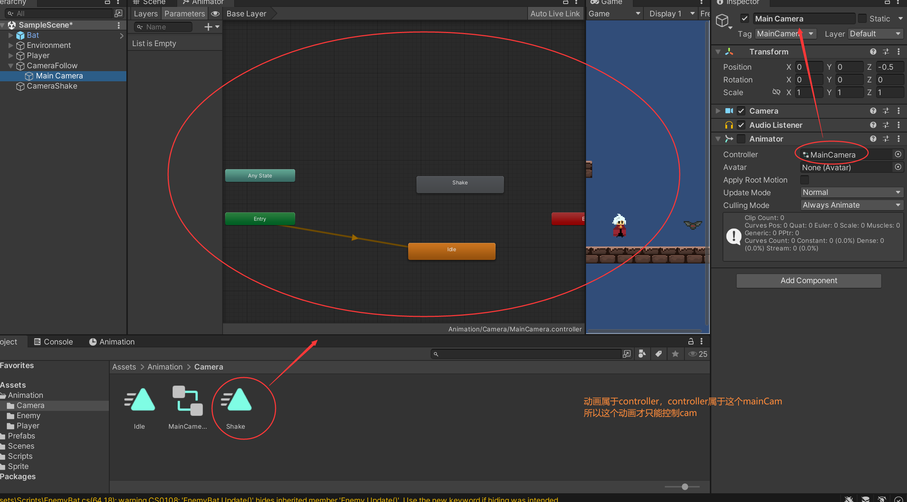
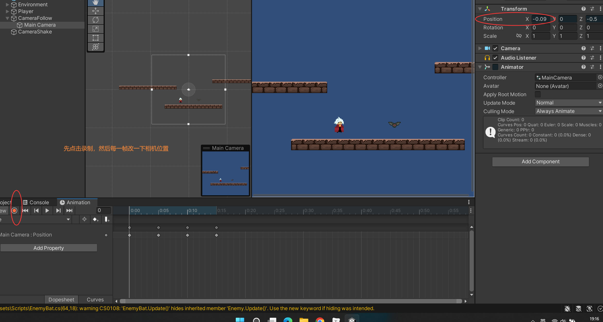
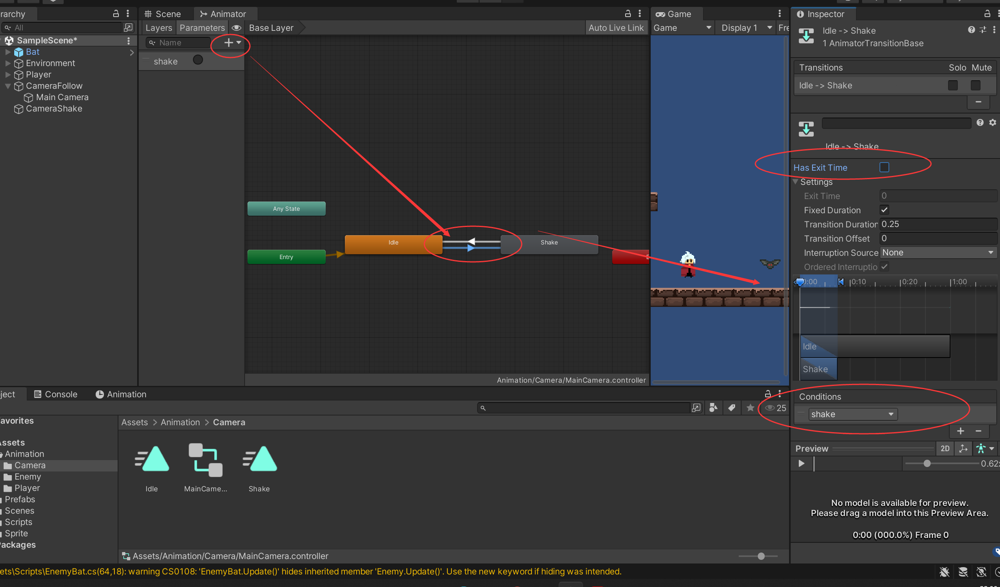
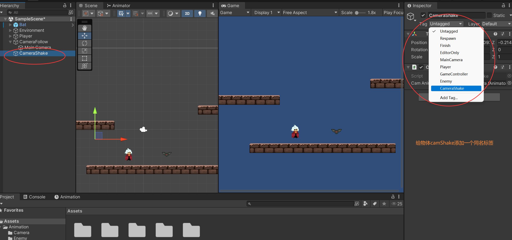

### 相机震动抖动 Camera Shake








录制动画







```c#

public class CameraShake : MonoBehaviour
{
    //主相机的动画
    [SerializeField]
    private Animator camAnimator;

    public void Shake()
    {
        camAnimator.SetTrigger("shake");
    }

}

```





```c#

public class GameController : MonoBehaviour
{
    // 全局唯一变量
    public static CameraShake singCamShake;
}

```

```c#

public class CameraFollow : MonoBehaviour
{

    void Start()
    {
        //获取脚本
        GameController.singCamShake = GameObject.FindGameObjectWithTag("CameraShake").GetComponent<CameraShake>();
    }


}

```

```c#

public abstract class Enemy : MonoBehaviour
{

    public void Takedamage(int damage)
    {
		...
        GameController.singCamShake.Shake();
    }

}

```

