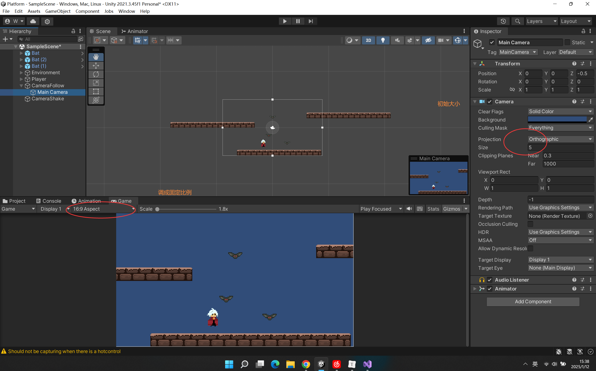
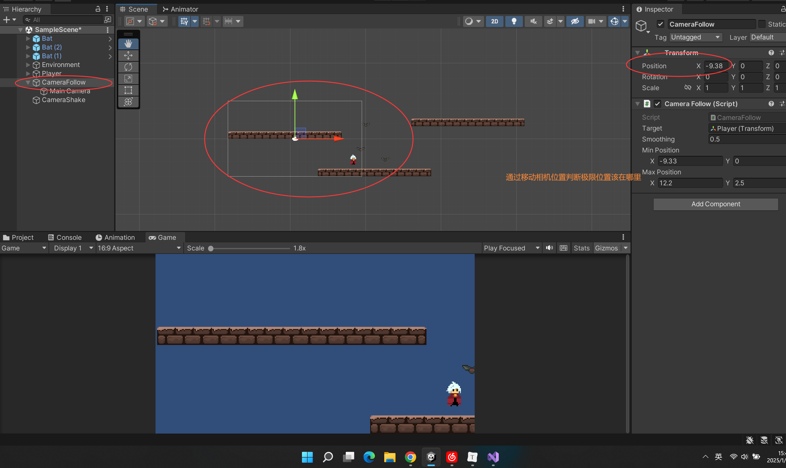

### 限制相机的移动范围 Camera Limit






```c#


public class CameraFollow : MonoBehaviour
{
    //相机移动的极限位置
    [SerializeField]
    private Vector2 minPosition;
    [SerializeField]
    private Vector2 maxPosition;


    void FixedUpdate()
    {
        if (target != null)
        {
            if(transform.position != target.position)
            {
                //限定大小 
                tarpos.x = Mathf.Clamp(tarpos.x, minPosition.x, maxPosition.x);
                tarpos.y = Mathf.Clamp(tarpos.y, minPosition.y, maxPosition.y);

				...
            }
        }
    }
    //外部改变相机移动限制
    public void SetCamPosLimit(Vector2 minPos, Vector2 maxPos)
    {
        minPosition = minPos;
        maxPosition = maxPos;
    }

}

```

