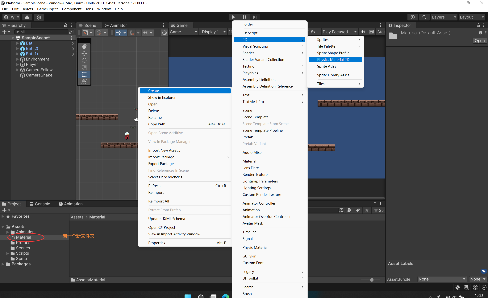
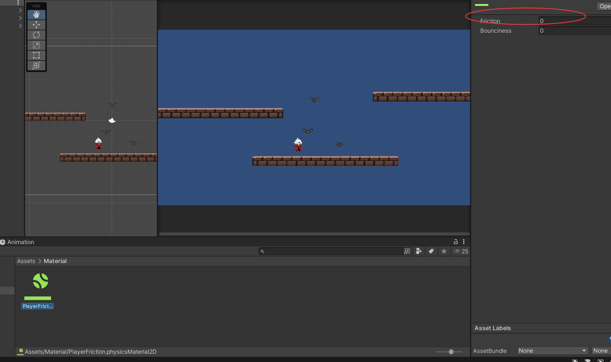
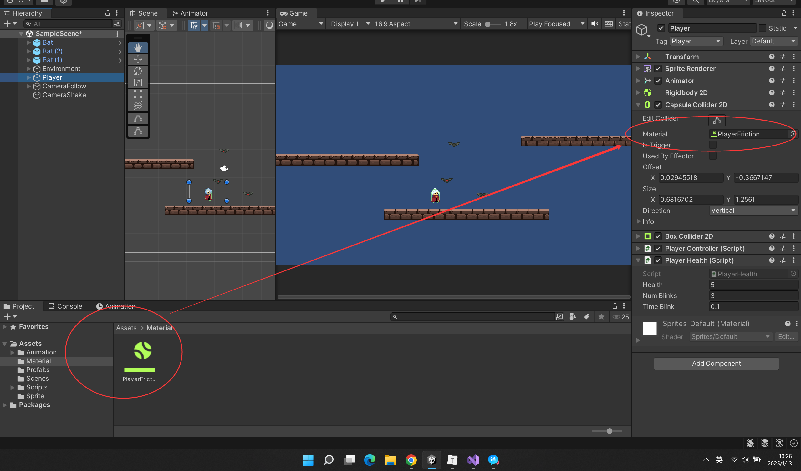
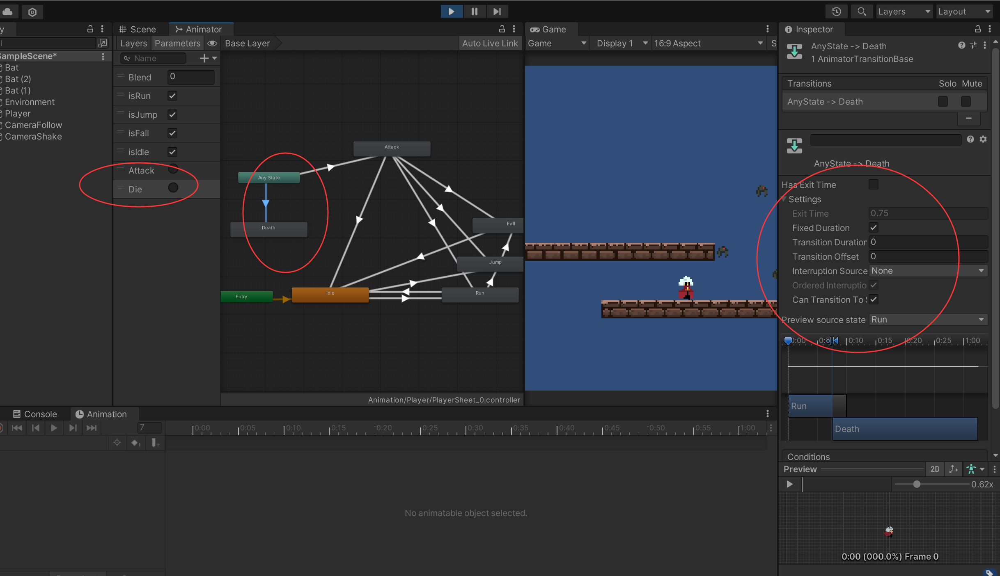
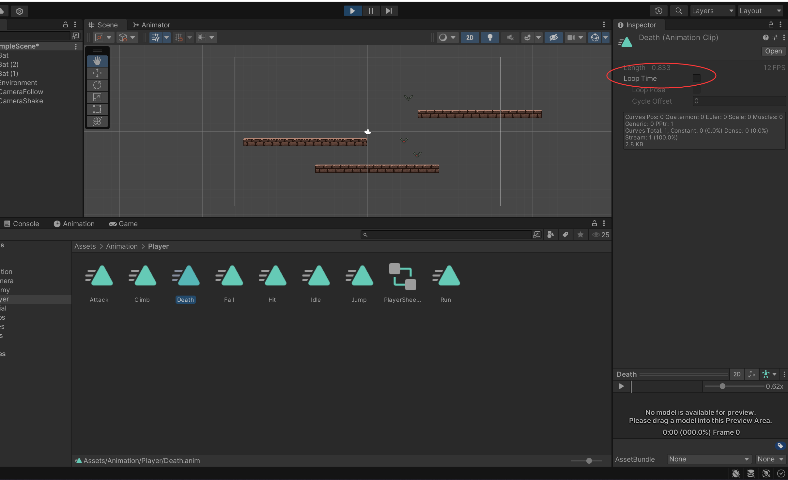

### Player死亡功能 Player Death


消除卡墙摩擦力












 ```c#

public class PlayerHealth : MonoBehaviour
{

    private Animator myAnimator;
    [SerializeField]
    private float dieTime = 1f;

    void Start()
    {	
    	...
        myAnimator = GetComponent<Animator>();
    }

    public void DamagePlayer(int damage)
    {
        if (health <= 0)
        {
            myAnimator.SetTrigger("Die");
            Invoke("KillPlayer", dieTime);
        }
		...
    }

    private void KillPlayer()
    {
        Destroy(gameObject);
    }
	
}

 ```

