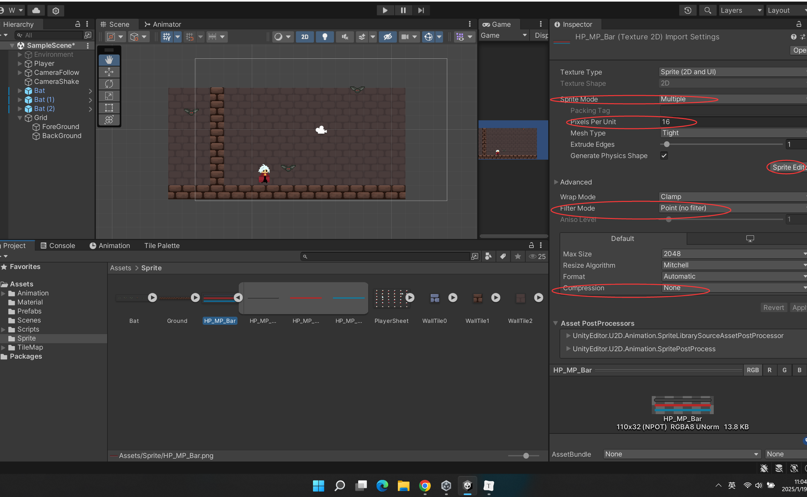
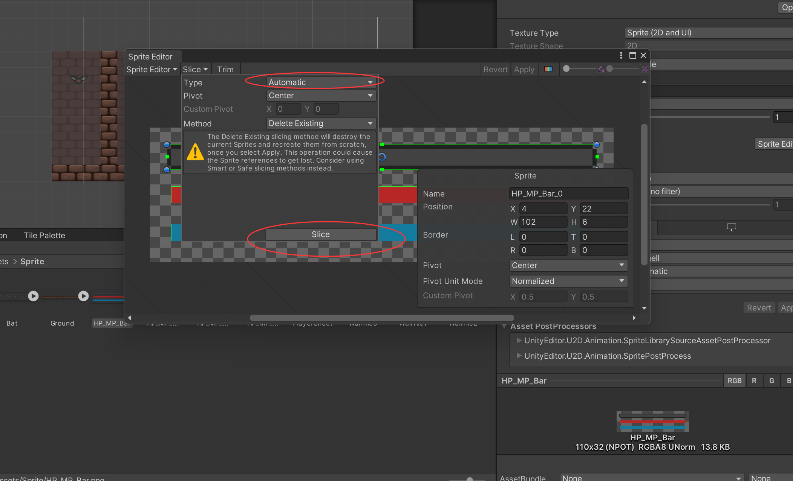
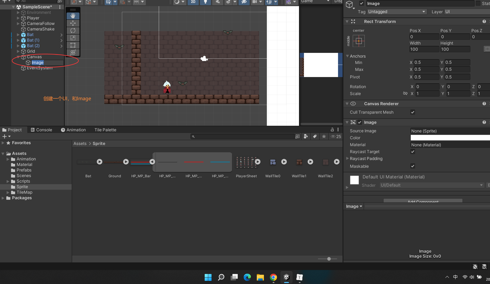
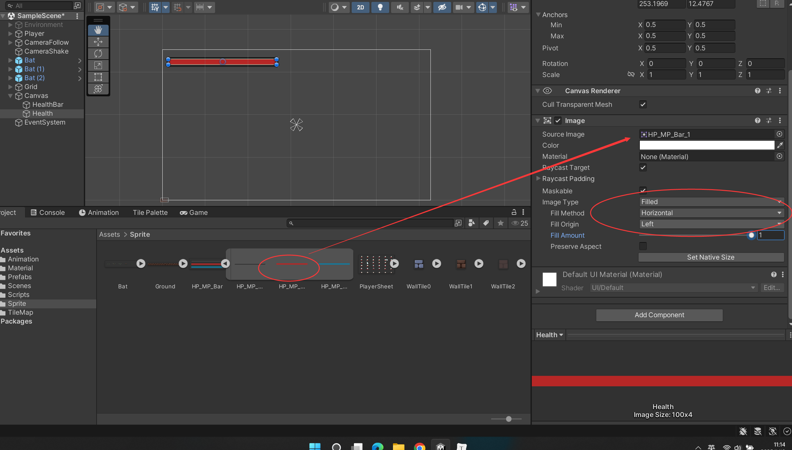
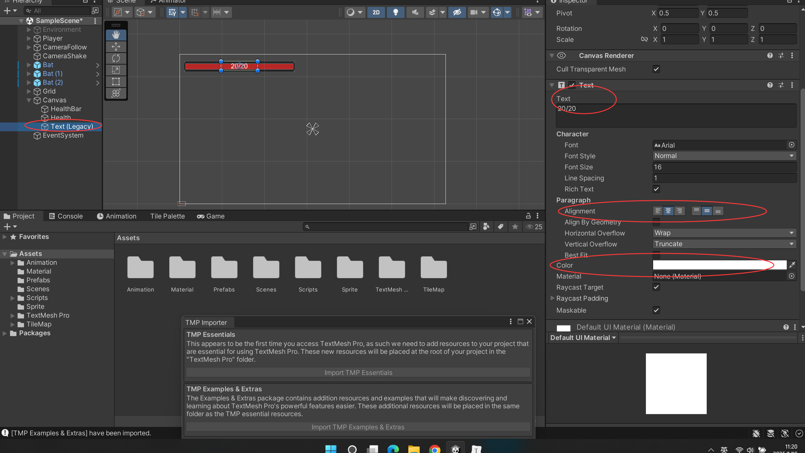
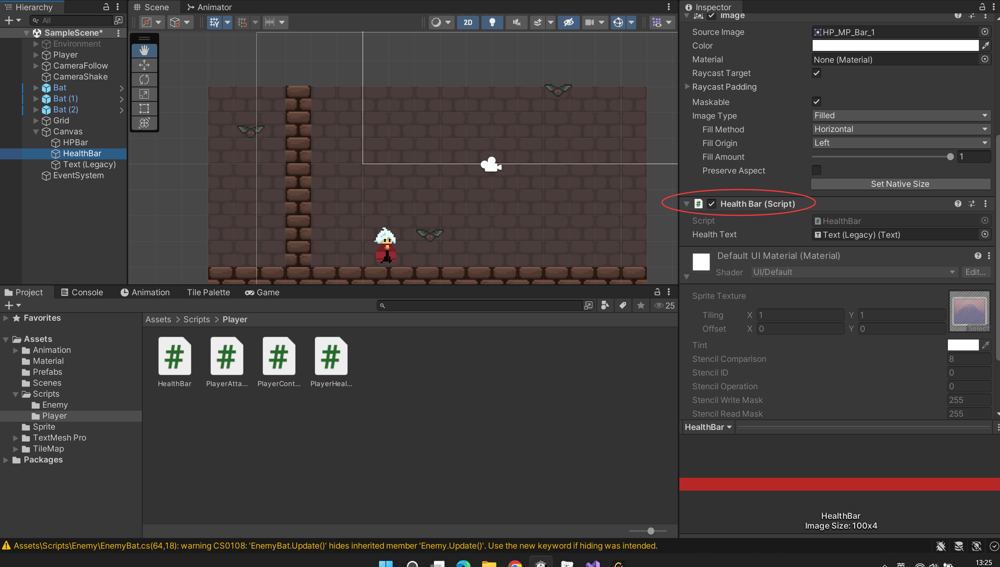

### Player生命值血条功能 Player Health Bar



切一下血条



  





UI排序是下面覆盖上面的



 ```c#

public class HealthBar : MonoBehaviour
{
    [SerializeField]
    private Text healthText;
    public static int currentHealth;
    public static int maxHealth;

    private Image healthBar;


    void Start()
    {
        healthBar = GetComponent<Image>();
        //currentHealth = maxHealth;
    }

    void Update()
    {
        healthBar.fillAmount = (float)currentHealth / (float)maxHealth;
        healthText.text = currentHealth.ToString() + "/" + maxHealth.ToString();
    }
}

 ```

```c#
using System.Collections;
using System.Collections.Generic;
using UnityEngine;

public class PlayerHealth : MonoBehaviour
{
    [SerializeField]
    private int health;

    void Start()
    {
        //player这里直接初始化
        HealthBar.maxHealth = health;
        HealthBar.currentHealth = health;
        //health = HealthBar.maxHealth;
    }

    public void DamagePlayer(int damage)
    {
        health -= damage;
        HealthBar.currentHealth = health;

        if (health <= 0)
        {
            HealthBar.currentHealth = 0;

        }
    }

}

```

