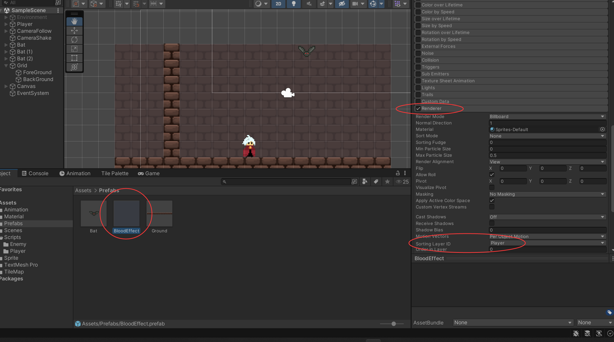
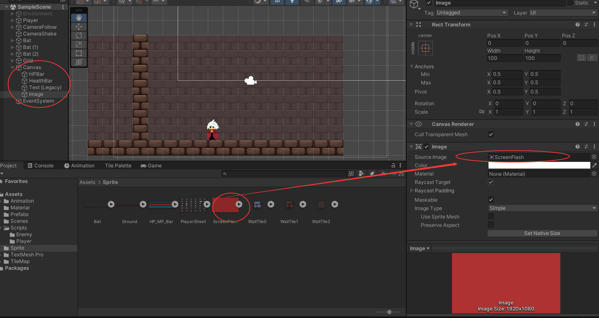
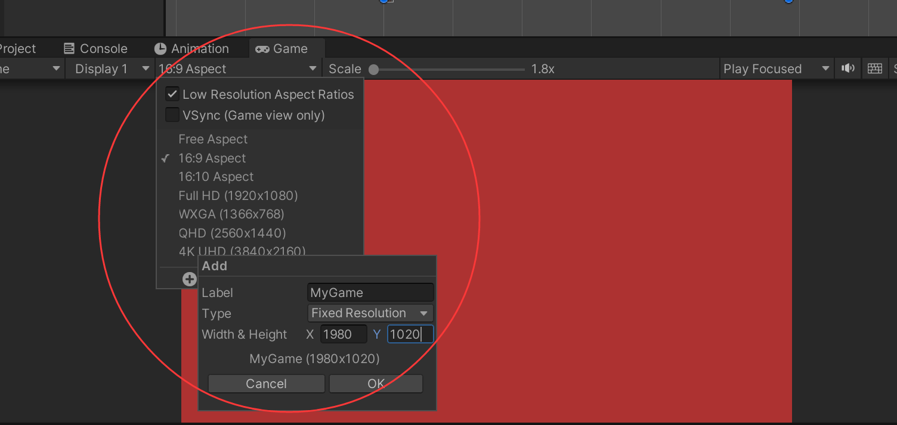
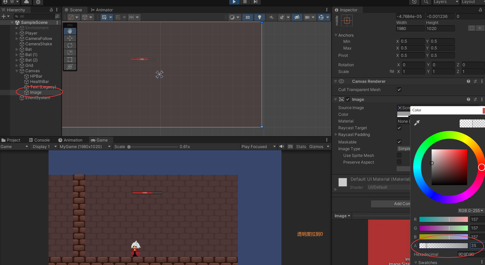
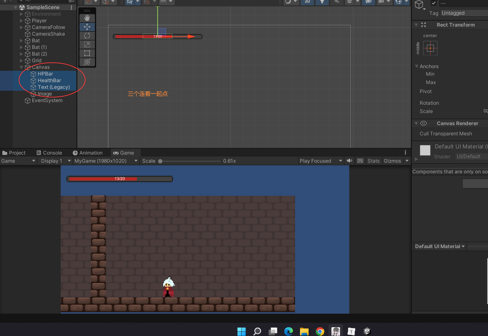
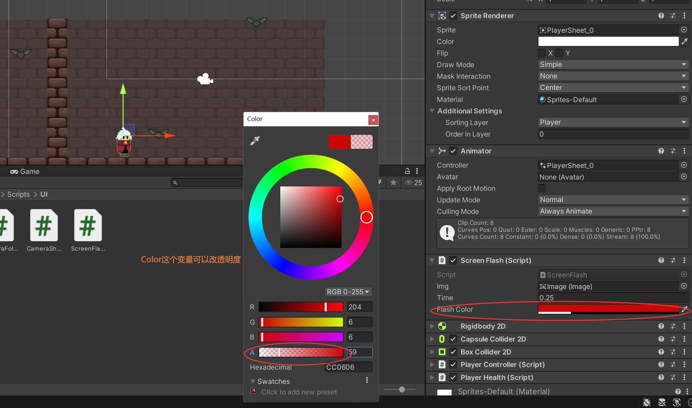

### Player受伤时屏幕红闪功能 Screen Flash

解决一下蝙蝠受伤没有粒子效果的bug






新建游戏尺寸







```c#
//要加这个UI里的image
using UnityEngine.UI;

//给Player
public class ScreenFlash : MonoBehaviour
{
    [SerializeField]
    private Image img;
    [SerializeField]
    private float time;
    [SerializeField]
    private Color flashColor;
    private Color defaultColor;


    void Start()
    {
        defaultColor = img.color;    
    }

    public void FlashScreen()
    {
        StartCoroutine(Flash());
        print("fsdf");  
    }

    IEnumerator Flash()
    {
        img.color = flashColor;
        yield return new WaitForSeconds(time);
        img.color = defaultColor;
    }

    // Update is called once per frame
    void Update()
    {
        
    }
}

```

```c#

public class PlayerHealth : MonoBehaviour
{

    private ScreenFlash sf;

    void Start()
    {

        sf = GetComponent<ScreenFlash>();
    }

    public void DamagePlayer(int damage)
    {
        //这里调用一下
        sf.FlashScreen();

    }

}

```




处理一下死亡状态

```c#

public class GameController : MonoBehaviour
{

    public static bool isGameAlive = true;
}

```

```c#

public class PlayerController : MonoBehaviour
{

    void Update()
    {
        if (GameController.isGameAlive)
        {
            Run();
            Filp();
            CheckIsGround();
            SwitchAnimation();
            Jump();
        }


    }
}

```

```c#

public class PlayerHealth : MonoBehaviour
{

    private Rigidbody2D rb;

    void Start()
    {

        rb = GetComponent<Rigidbody2D>();
    }

    public void DamagePlayer(int damage)
    {
        if (health <= 0)
        {
            GameController.isGameAlive = false;
            rb.velocity = Vector2.zero;
        }
    }

}

```

