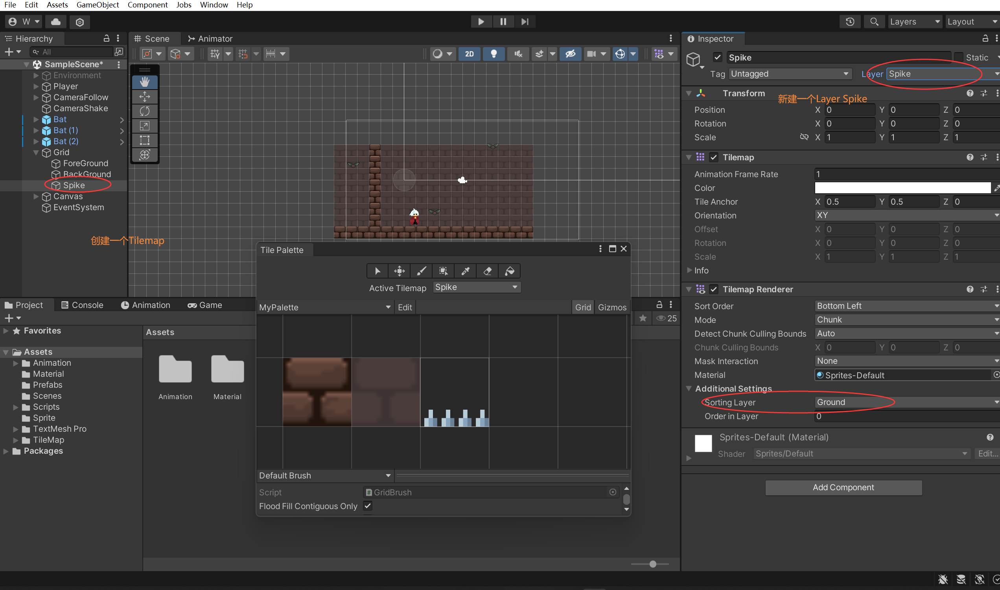
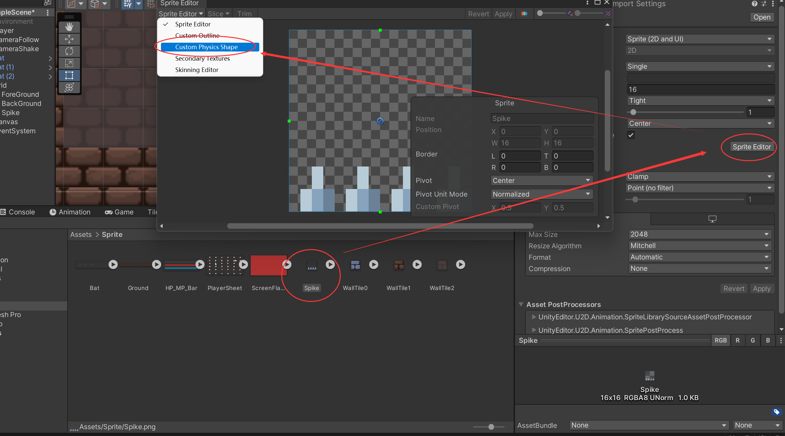

### 游戏地刺陷阱功能 2D Platform Spikes





处理贴图碰撞





要在Splike上reset一下


```c#


public class Spike : MonoBehaviour
{
    [SerializeField]
    private int damge;
    private PlayerHealth playerHealth;
    
    void Start()
    {
        playerHealth = GameObject.FindGameObjectWithTag("Player").GetComponent<PlayerHealth>();   
    }

    //地刺碰撞
    private void OnTriggerEnter2D(Collider2D collision)
    {
        if (collision.CompareTag("Player"))
        {
            playerHealth.DamagePlayer(damge);
        }
    }

}

```

然后解决

不能持续受伤

由于两个碰撞体会受伤两次的问题


```c#

public class Spike : MonoBehaviour
{

    //地刺碰撞
    private void OnTriggerEnter2D(Collider2D collision)
    {
         
        //并且碰撞体类型必须是
        if (collision.CompareTag("Player") && collision.GetType().ToString() == "UnityEngine.PolygonCollider2D")
        {
            playerHealth.DamagePlayer(damge);
        }
    }

}

```


```c#

public class PlayerHealth : MonoBehaviour
{
	...
    //用于地刺伤害的碰撞体
    private PolygonCollider2D polygonCollider2D;
    [SerializeField]
    private float hitBoxCdTime;

    void Start()
    {
		...
        polygonCollider2D = GetComponent<PolygonCollider2D>();
        
    }

    public void DamagePlayer(int damage)
    {
		...
        //受到伤害先消失
        polygonCollider2D.enabled = false;
        StartCoroutine(ShowPlayerHitBox());
    }

     IEnumerator ShowPlayerHitBox()
    {
        yield return new WaitForSeconds(hitBoxCdTime);
        polygonCollider2D.enabled = true;
    }


}

```

