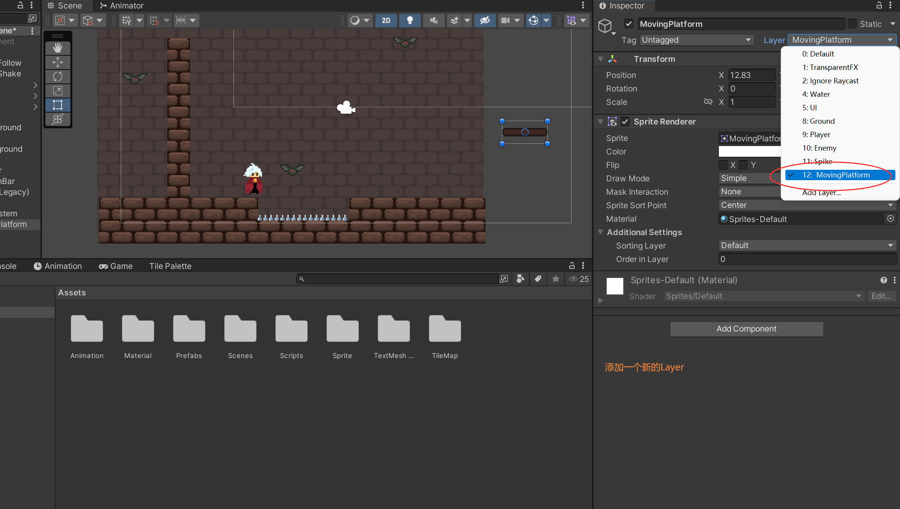
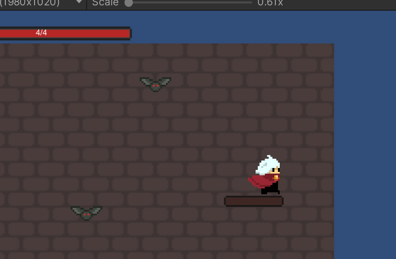
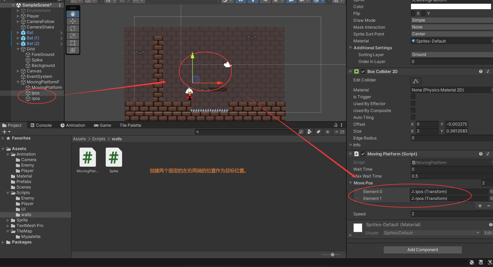

# 实现2D漂浮移动平台功能 Moving Platform






修改一下代码，当玩家在MovingPlatform时判定为触地

```c#
public class PlayerController : MonoBehaviour
{
	...

    //检测是否触地
    private void CheckIsGround()
    {
        isGround = feetColllider.IsTouchingLayers(LayerMask.GetMask("Ground")) 
            || feetColllider.IsTouchingLayers(LayerMask.GetMask("MovingPlatform"));
        if(isGround) canDoubleJump = true;
    }

}

```

在MovingPlatform下面创建一个同名脚本



```c#
using System.Collections;
using System.Collections.Generic;
using UnityEngine;

public class MovingPlatform : MonoBehaviour
{
    [SerializeField]
    private float waitTime;
    [SerializeField]
    private float maxWaitTime;
    [SerializeField]
    private Transform[] movePos;
    [SerializeField]
    private float speed;
    //记录一下play默认的父节点
    private Transform playerDefTransform;

    private int i;


    void Start()
    {
        i = 1;
        playerDefTransform = GameObject.FindGameObjectWithTag("Player").transform.parent;
    }


    void Update()
    {
        //板砖移动
        transform.position = Vector2.MoveTowards(transform.position, movePos[i].position, Time.deltaTime * speed);
        //终点等待
        if (Vector2.Distance(transform.position, movePos[i].position) < 0.01f)
        {
            if(waitTime < 0.01f)
            {
                waitTime = maxWaitTime;
                i ^= 1;
            }
            else
            {
                waitTime -= Time.deltaTime;
            }
        }
    }

      //人物在平台上后的行为
    private void OnTriggerEnter2D(Collider2D collision)
    {
        
        if(collision.CompareTag("Player") && collision.GetType().ToString() == "UnityEngine.BoxCollider2D")
        {
            collision.gameObject.transform.parent = transform;
        }
    }
    private void OnTriggerExit2D(Collider2D collision)
    {

        if (collision.CompareTag("Player") && collision.GetType().ToString() == "UnityEngine.BoxCollider2D")
        {
            collision.gameObject.transform.parent = playerDefTransform;
        }
    }
}

```

