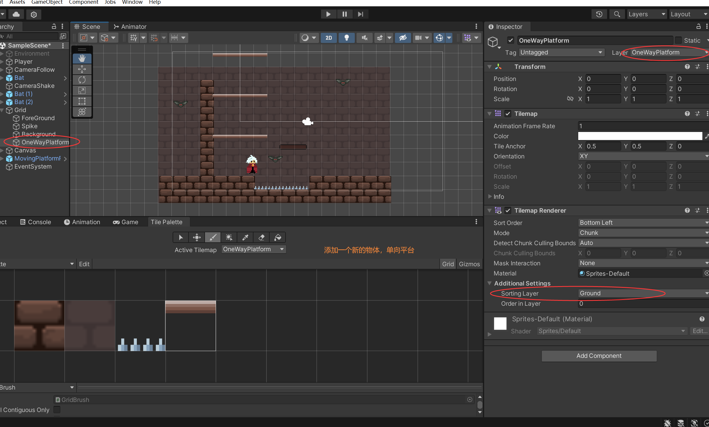
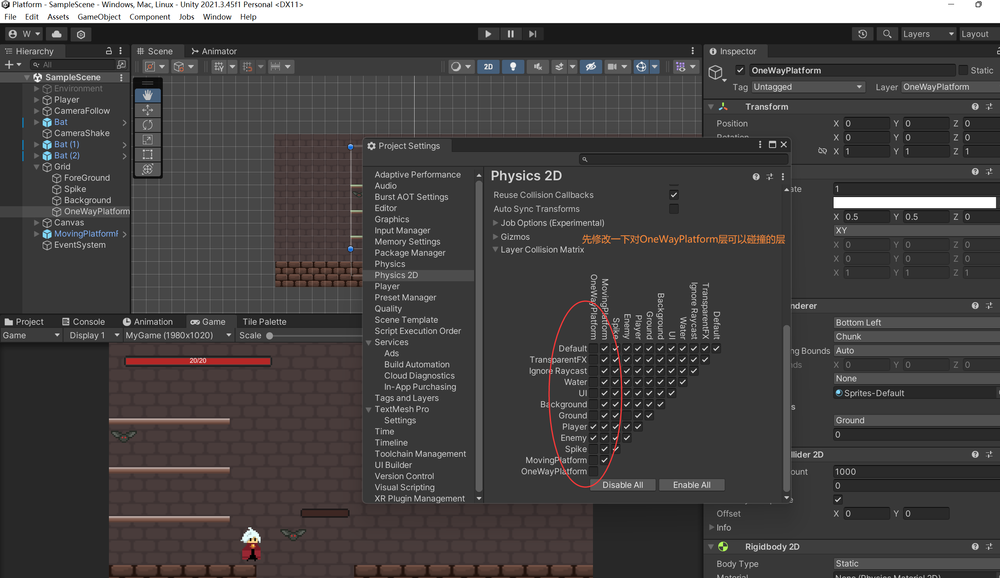
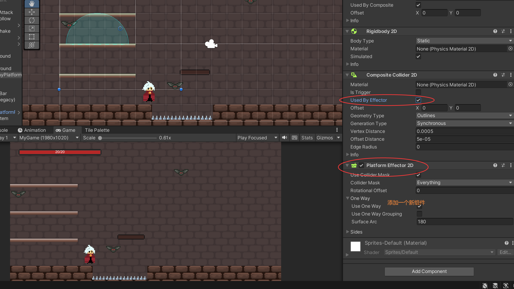
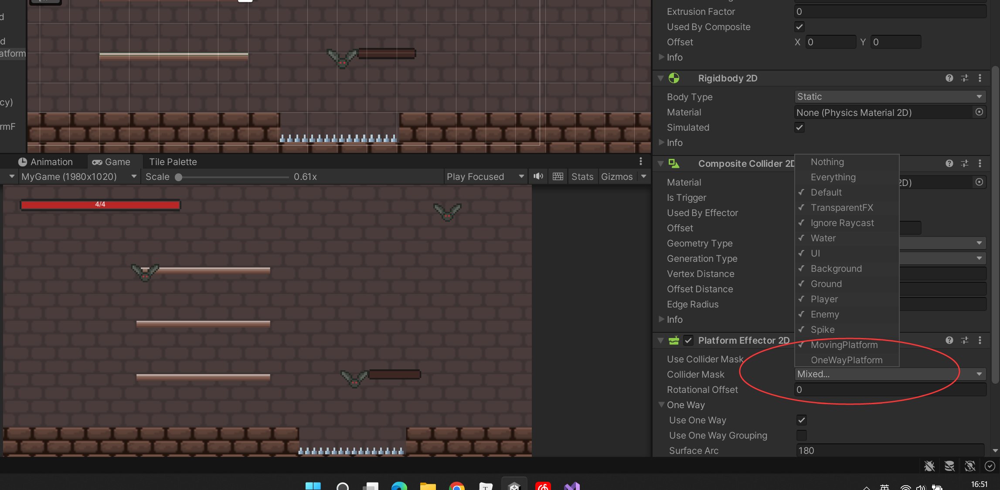

# 实现单向跳跃平台功能 OneWayPlatform






  在这个平台是也属于触地

```c#
    private void CheckIsGround()
    {
        isGround =
             ...
                || feetColllider.IsTouchingLayers(LayerMask.GetMask("OneWayPlatform"));

        
    }
```






```c#

public class PlayerController : MonoBehaviour
{
	...
    private bool isOneWayPlatform; //判断是否在单向平台
    


    //检测是否触地
    private void CheckIsGround()
    {
        isGround = feetColllider.IsTouchingLayers(LayerMask.GetMask("Ground"))
                || feetColllider.IsTouchingLayers(LayerMask.GetMask("MovingPlatform"))
                || feetColllider.IsTouchingLayers(LayerMask.GetMask("OneWayPlatform"));
        //判断是否在单向平台
        isOneWayPlatform = feetColllider.IsTouchingLayers(LayerMask.GetMask("OneWayPlatform"));
		...
        
    }

    //跳跃
    private void Jump()
    {
        if (Input.GetButtonDown("Jump") && !Input.GetKey(KeyCode.S)) 
        {
			...
        }
    }


    //下落平台
    void OneWayPlatformCheck()
    {
        if (Input.GetKey(KeyCode.S) && Input.GetButtonDown("Jump") && isOneWayPlatform)
        {
            gameObject.layer = LayerMask.NameToLayer("OneWayPlatform");
            //调整回复时间
            Invoke("RestorePlayerLayer", 0.35f);
        }
    }
    //回复下落
    void RestorePlayerLayer()
    {
        if(!isGround && gameObject.layer != LayerMask.NameToLayer("Player"))
        {
            gameObject.layer = LayerMask.NameToLayer("Player");
        }
    }

    void Update()
    {
        if (GameController.isGameAlive)
        {
			...
            OneWayPlatformCheck();
        }

    }
}

```

