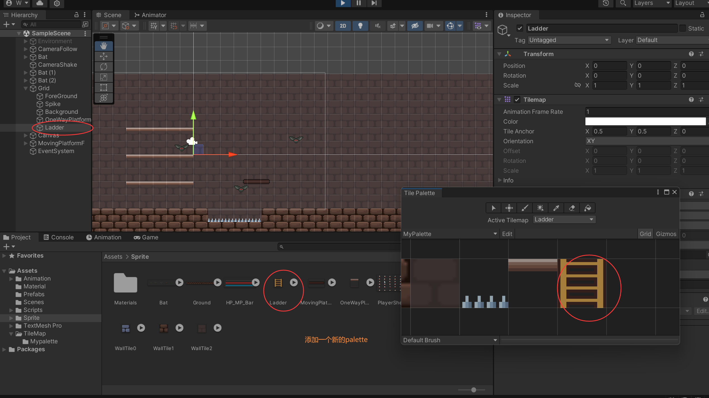
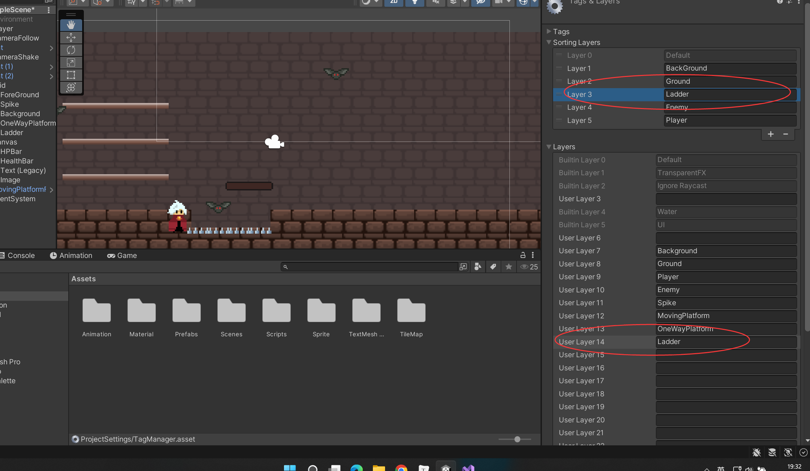
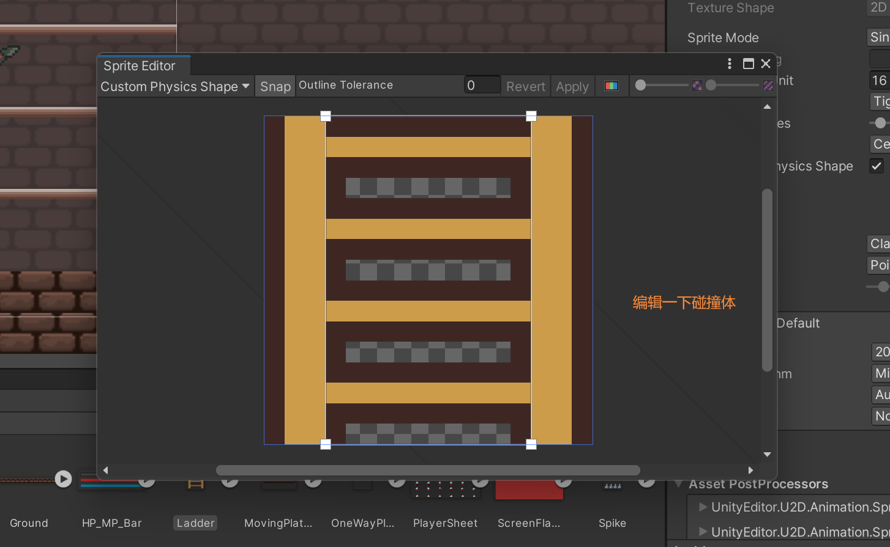
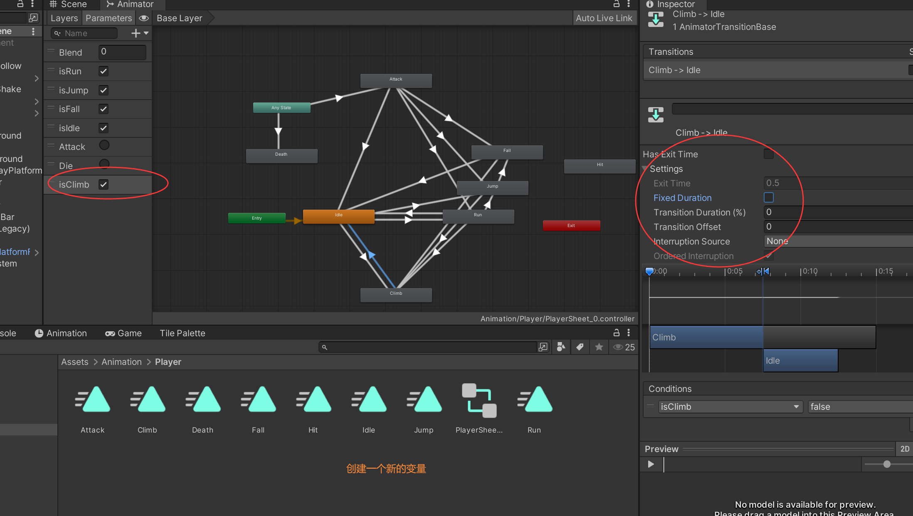

# 实现Player爬梯子功能 2D Ladder










```c#

public class PlayerController : MonoBehaviour
{
	...
    [SerializeField]
    private float climbSpeed = 5; //攀爬速度


	...
    private float playerGravity; //player原来的重力
	
    ...
    private bool isLadder; //在梯子上否
    private bool isClimbing = false;
    


    void Start()
    {
		...
        playerGravity = rb.gravityScale;
    }
    //检测是否触地
    private void CheckIsGround()
    {
		...
        //判断是否再梯子上
        isLadder = feetColllider.IsTouchingLayers(LayerMask.GetMask("Ladder"));

        if (isGround)
        {
            canDoubleJump = true;
        }
        
    }

    ...
    
    //攀爬
    void Climb()
    {

        if (isLadder)
        {
            float moveY = Input.GetAxisRaw("Vertical");
            if (moveY != 0f)
            {
                animator.SetBool("isClimb", true);
                rb.velocity = new Vector2(rb.velocity.x, moveY * climbSpeed);
                rb.gravityScale = 0f;
                isClimbing = true;
            }else if (isClimbing)
            {
                rb.velocity = new Vector2(rb.velocity.x, 0f);
            }
        }
        else
        {
            animator.SetBool("isClimb", false);
            isClimbing = false;
            if (!isGround) animator.SetBool("isFall", true);
            else animator.SetBool("isIdle", true);
            rb.gravityScale = playerGravity;
        }
    }

    void Update()
    {
        if (GameController.isGameAlive)
        {
			...
            Climb();
        }

    }
}

```

