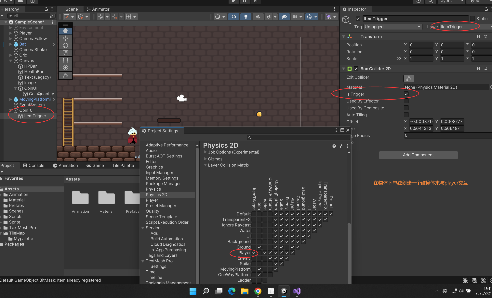

### 实现Player捡起金币和怪物金币掉落功能


```c#
using UnityEngine.UI;

public class CoinUI : MonoBehaviour
{
    [SerializeField]
    private int initialCoin; //初始金币
    public static int currentCoin; //当前金币
    [SerializeField]
    private Text coinQuantityText; //金币数文本
   
    void Start()
    {
        currentCoin = initialCoin;
    }

    void Update()
    {
        coinQuantityText.text = currentCoin.ToString();
    }
}

```





```c#

public class CoinItem : MonoBehaviour
{

    private void OnTriggerEnter2D(Collider2D collision)
    {
        
        if(collision.CompareTag("Player") && 
            collision.GetType().ToString() == "UnityEngine.CapsuleCollider2D")
        {
            CoinUI.currentCoin += 1;
            Destroy(gameObject);
        }
    }
}

```

```c#

//建一个抽象类，Enemy共同的属性
public abstract class Enemy : MonoBehaviour
{

    [SerializeField]
    private GameObject dropCoin; //掉落金币

    // 必须是public
    public void Update()
    {
        if(health <= 0)
        {
            Instantiate(dropCoin, transform.position, Quaternion.identity);
            Destroy(gameObject);

        }
    }

}

```


