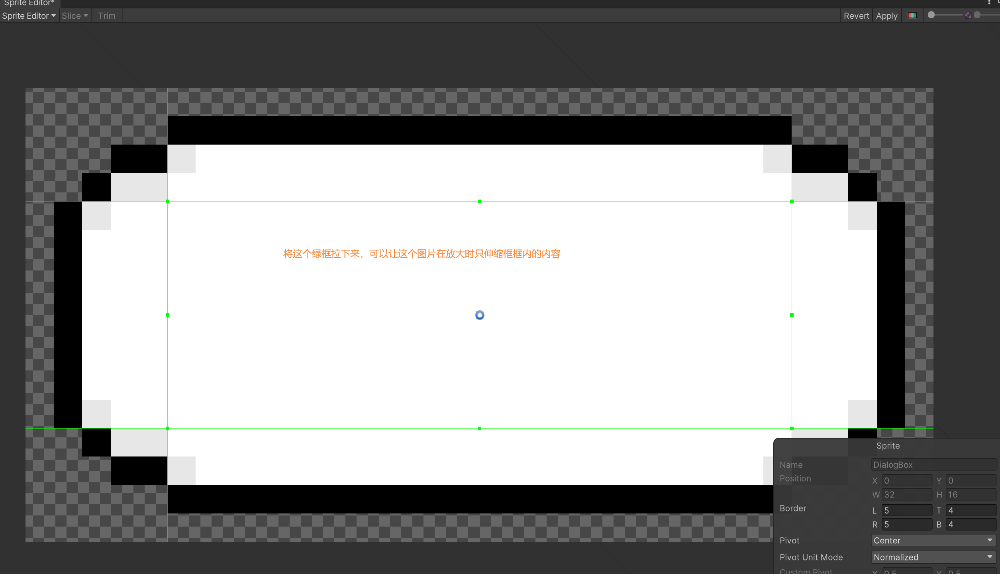
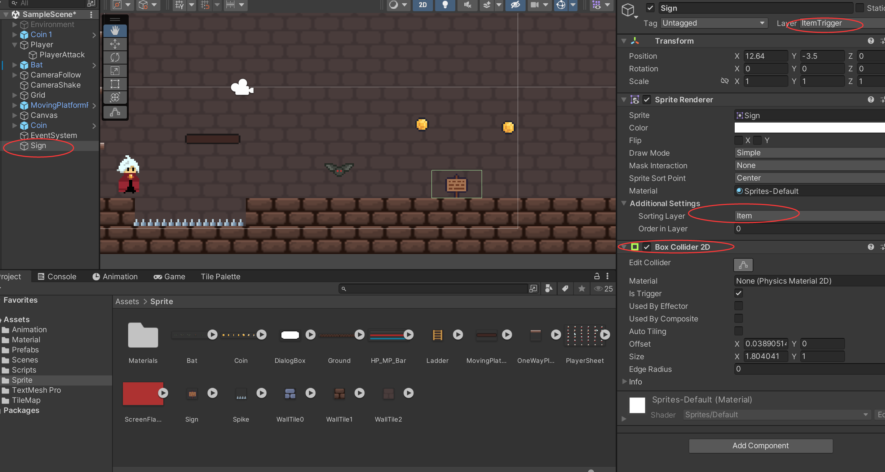

# 文字对话框功能 






```c#

using UnityEngine.UI;

public class Sign : MonoBehaviour
{
    [SerializeField]
    private GameObject dialogBox;
    [SerializeField]
    private Text dialogBoxText;
    [SerializeField]
    private string words;
    private bool isSign = false;

    private void OnTriggerEnter2D(Collider2D collision)
    {
        
        if(collision.CompareTag("Player") && 
            collision.GetType().ToString() == "UnityEngine.CapsuleCollider2D")
        {

            isSign = true;

        }
    }

    private void OnTriggerExit2D(Collider2D collision)
    {
        if (collision.CompareTag("Player") &&
            collision.GetType().ToString() == "UnityEngine.CapsuleCollider2D")
        {
            isSign = false;
            dialogBox.SetActive(false);
        }
    }

    private void Update()
    {
        if(Input.GetKeyDown(KeyCode.E) && isSign)
        {

            dialogBox.SetActive(true);
        }
    }

}

```

