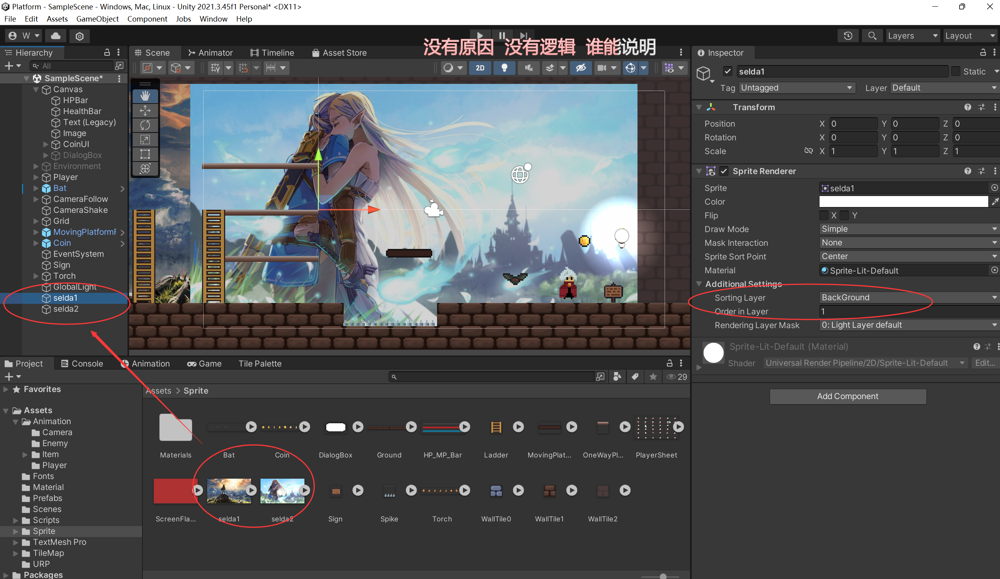
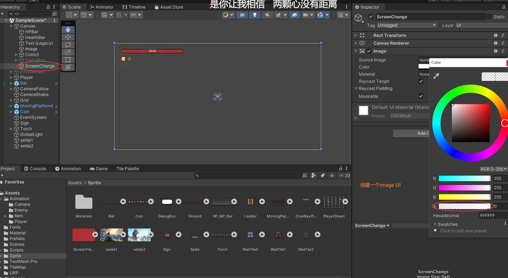
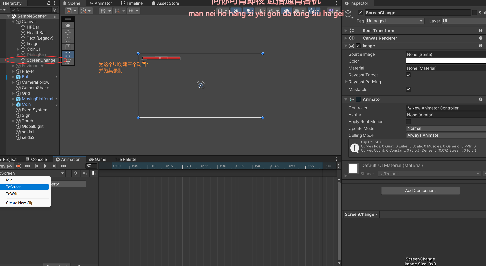
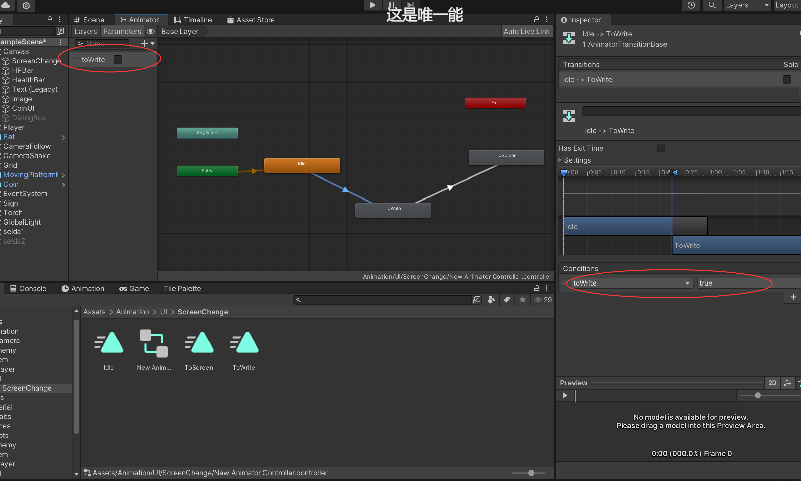

# 背景平滑切换










```c#

public class ScreenChange : MonoBehaviour
{
    [SerializeField]
    private GameObject img1;
    [SerializeField]
    private GameObject img2;
    [SerializeField]
    private float time = 0.5f;

    
    private Animator animator;

    void Start()
    {
        animator = GetComponent<Animator>();
    }

    void ChangeImg()
    {
        img1.SetActive(false);
        img2.SetActive(true);
    }

    void Update()
    {
        if (Input.GetKeyDown(KeyCode.H))
        {
            animator.SetBool("toWrite", true);
            Invoke("ChangeImg", time);
        }
    }
}

```

