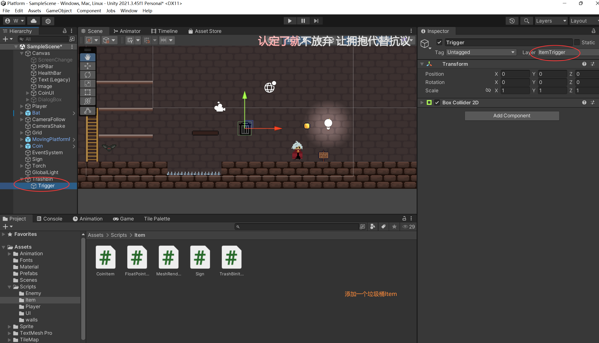
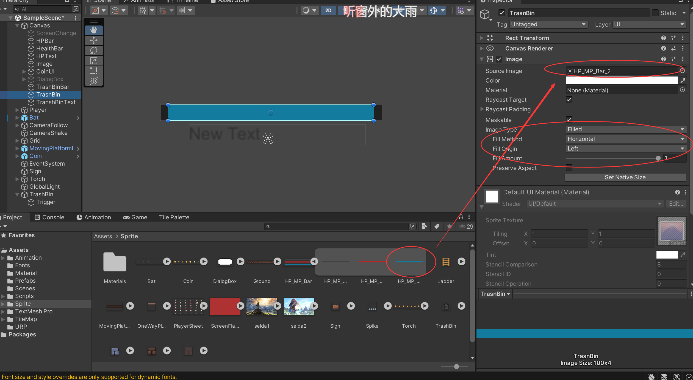
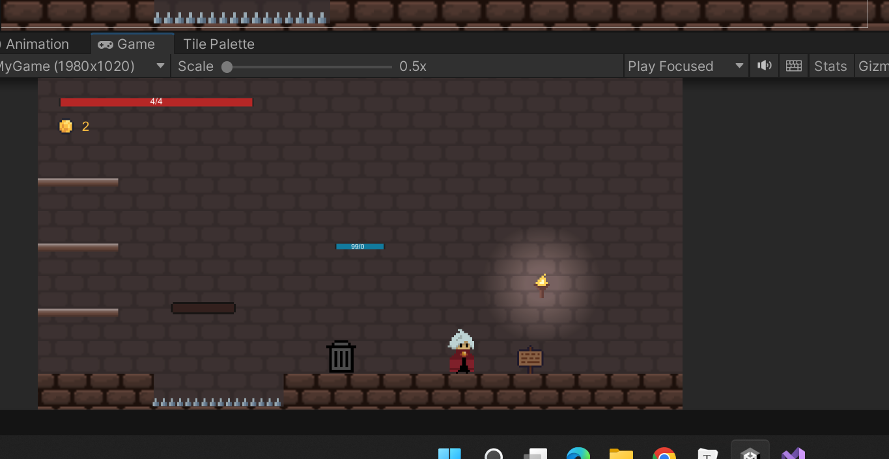
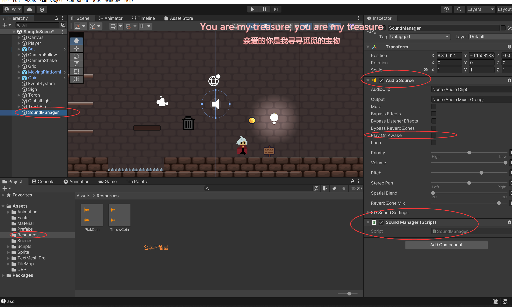

# 音效功能&坐标系





创建好了这个UI，他是跟着Player走的



```c#
using UnityEngine.UI;

//在Canvas下创建这个脚本
public class UIManager : MonoBehaviour
{
    //让UI元素跟随世界物体
    [SerializeField]
    private RectTransform UIElement;
    [SerializeField]
    private RectTransform CanvasRect;
    [SerializeField]
    private Transform trashBinPos;
    [SerializeField]
    private float xoffset = 0f;
    [SerializeField]
    private float yoffset = 0f;
    [SerializeField]
    private Text coinNum;


    // Update is called once per frame
    void Update()
    {
        Vector2 viewportPos = Camera.main.WorldToViewportPoint(trashBinPos.position);
        Vector2 worldOjectScreenPos
            = new Vector2(viewportPos.x * CanvasRect.sizeDelta.x - (CanvasRect.sizeDelta.x * 0.5f) + xoffset,
                          viewportPos.y * CanvasRect.sizeDelta.y - (CanvasRect.sizeDelta.y * 0.5f) + yoffset);
        UIElement.anchoredPosition = worldOjectScreenPos;

    }
}

```


实现按Y给垃圾桶投币

```c#
public class TrashBinItem : MonoBehaviour
{


    // Update is called once per frame
    void Update()
    {
        if (Input.GetKeyDown(KeyCode.Y) && isTranshBin)
        {
            print("asd");
            if (CoinUI.currentCoin > 0)
            {
                CoinUI.currentCoin--;
                TrashBinCoin.currentCoin++;
            }
        }
    }
}

```

```c#
//UI的TrashBin创建
using UnityEngine.UI;

public class TrashBinCoin : MonoBehaviour
{
    [SerializeField]
    private Text coinText;
    public static int currentCoin;
    private int maxCoin = 99;
    //[SerializeField]
    private Image trashBar;

    void Start()
    {
        currentCoin = 0;
        trashBar = GetComponent<Image>();
    }

    // Update is called once per frame
    void Update()
    {
        coinText.text = maxCoin.ToString() + " / " + currentCoin.ToString();
        trashBar.fillAmount = (float)currentCoin / (float)maxCoin;
    }
}

```



```c#

public class SoundManager : MonoBehaviour
{
    public static AudioSource m_AudioSource;
    public static AudioClip pickCoin;
    public static AudioClip throwCoin;

    // Start is called before the first frame update
    void Start()
    {
        m_AudioSource = GetComponent<AudioSource>();
        pickCoin = Resources.Load<AudioClip>("PickCoin");
        throwCoin = Resources.Load<AudioClip>("throwCoin");
    }

    public static void PlayerPickCoin()
    {
        m_AudioSource.PlayOneShot(pickCoin);
    }

    public static void PlayThrowCoin()
    {
        m_AudioSource.PlayOneShot(throwCoin);
    }


}

```

