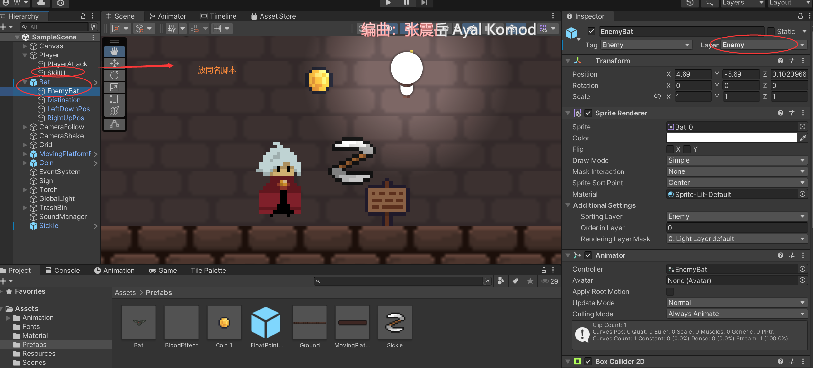
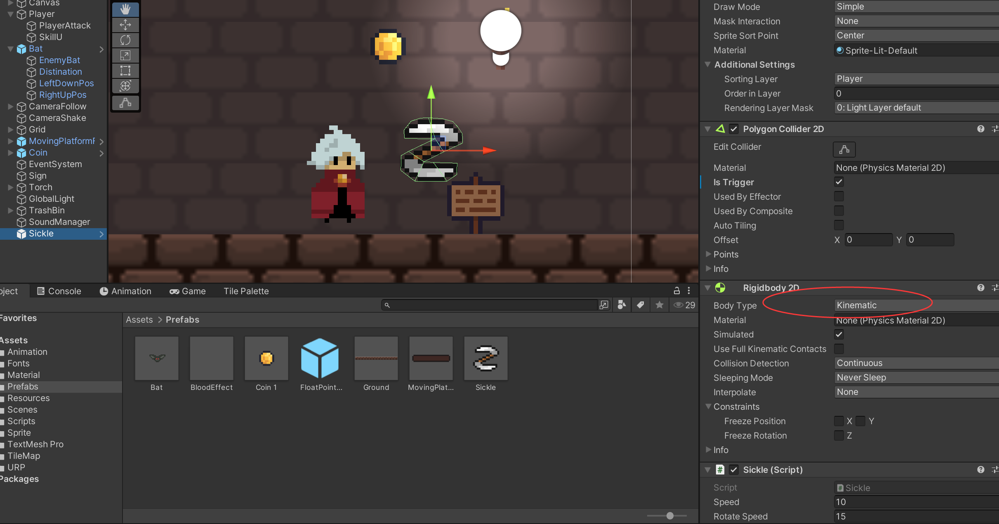

# 回旋镖






```c#

public class Sickle : MonoBehaviour
{
    [SerializeField]
    private float speed;
    [SerializeField]
    private float rotateSpeed;
    [SerializeField]
    private int damage;
    [SerializeField]
    private float tuning = 0.1f;

    private Rigidbody2D rb;
    private Transform playerTransform;
    private Transform sickleTransform;
    private Vector2 startSpeed; // 记录初始速度（矢量）
    private CameraShake cameraShake;

    private bool isBack = false;
    public float returnSpeed = 5f;
    public float invokeTime = 0.01f;
    public float maxDis = 10f;


    void Start()
    {
        rb = GetComponent<Rigidbody2D>();

        playerTransform = GameObject.FindGameObjectWithTag("Player").GetComponent<Transform>();
        cameraShake = GameObject.FindGameObjectWithTag("CameraShake").GetComponent<CameraShake>();
        rb.velocity = playerTransform.right * speed; //初始速度和方向
        startSpeed = rb.velocity;
    }

    void OnTriggerEnter2D(Collider2D collision)
    {
        if (collision.gameObject.CompareTag("Enemy"))
        {
            collision.GetComponent<Enemy>().Takedamage(damage);
        }
    }

    //飞回来
    void FlyToPlayer()
    {
        transform.position = Vector2.Lerp(transform.position, playerTransform.position, tuning);
    }

    void Update()
    {
        //最后一个参数是旋转速度，z轴的
        transform.Rotate(0, 0, rotateSpeed);

        //消失
        if (
            Mathf.Abs(transform.position.x - playerTransform.position.x) < 0.5f &&
            Mathf.Abs(transform.position.y - playerTransform.position.y) < 0.5f ||
            Mathf.Abs(transform.position.magnitude - playerTransform.position.magnitude) >= maxDis)
        {
            Destroy(gameObject);
        }
        //改状态
        if(rb.velocity.magnitude <= 0.8f)
        {
            isBack = true;
        }

        if (isBack)
        {
            InvokeRepeating("FlyToPlayer", invokeTime, returnSpeed);
        }
        else
        {
            //减速
            rb.velocity = rb.velocity - Time.deltaTime * startSpeed;
        }

    }
}


```

```c#

public class SkillU : MonoBehaviour
{
    [SerializeField]
    private GameObject sickle; 


    // Update is called once per frame
    void Update()
    {
        if (Input.GetKeyDown(KeyCode.U))
        {
            Instantiate(sickle, transform.position, Quaternion.identity);
        }
    }
}

```

