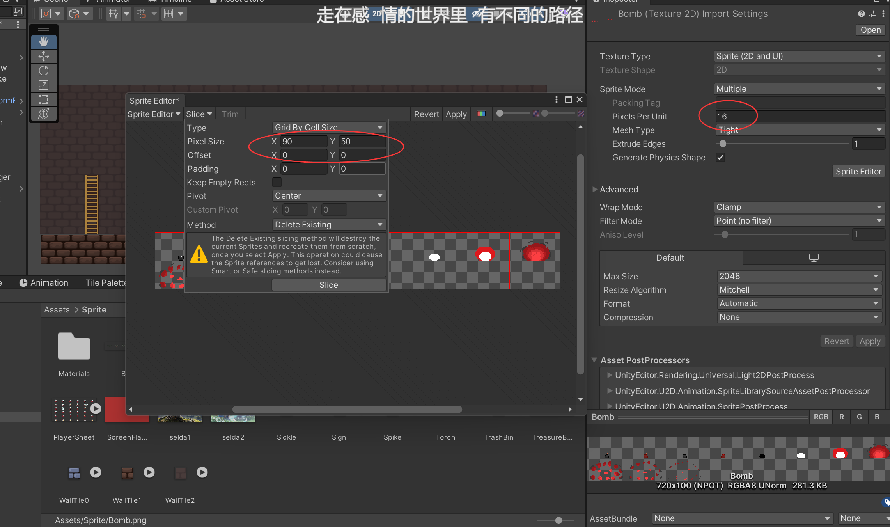
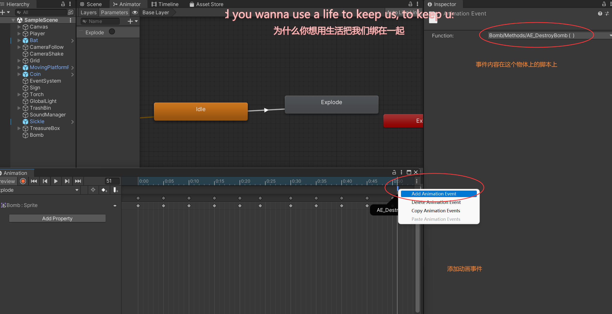
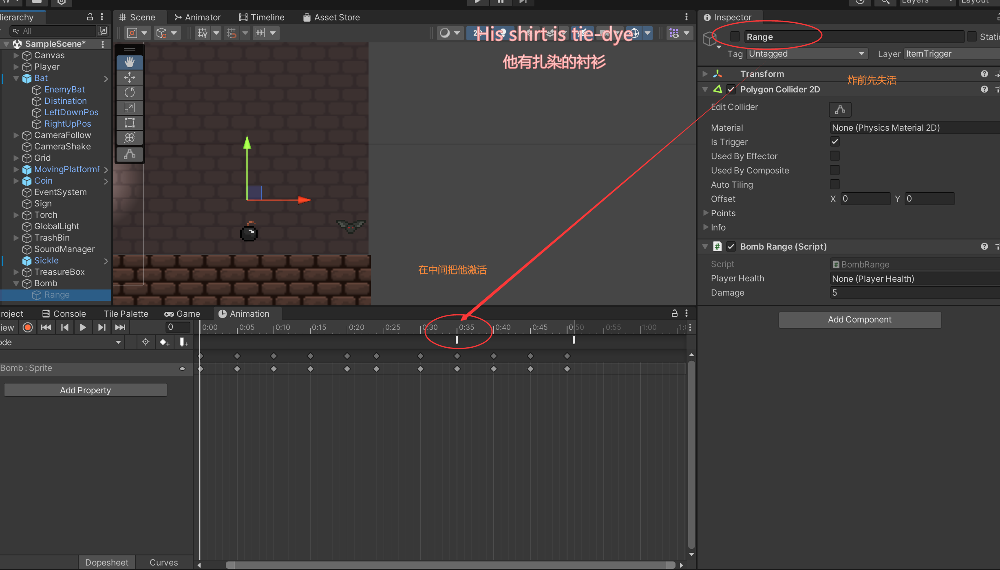

# 炸弹





```c#

public class Bomb : MonoBehaviour
{
    private Rigidbody2D rb;
    private Animator animator;
    [SerializeField]
    private Vector2 startSpeed;
    [SerializeField]
    private float delayExplodeTime =1.0f;
    [SerializeField]
    private GameObject range;

    void Start()
    {
        rb = GetComponent<Rigidbody2D>();
        animator = GetComponent<Animator>();
        rb.velocity = transform.right * startSpeed.x + transform.up * startSpeed.y;
        Invoke("Explode", delayExplodeTime);
        
    }

    void Explode()
    {
        animator.SetTrigger("Explode");
        rb.gravityScale = 0f; //爆炸时消除重力影响
    }
    void AE_DestroyBomb()
    {
        Destroy(gameObject);

    }
    void AE_CreateRange()
    {
        //Instantiate(range, transform.position, Quaternion.identity);
        range.SetActive(true);
    }

    // Update is called once per frame
    void Update()
    {
        
    }
}

```



```c#

public class BombRange : MonoBehaviour
{
    [SerializeField]
    private PlayerHealth PlayerHealth;
    [SerializeField]
    private int damage = 2;
    [SerializeField]
    private float ExpForce;

    // Start is called before the first frame update
    void Start()
    {
        
    }
    private void OnTriggerEnter2D(Collider2D collision)
    {
        if (collision.CompareTag("Enemy"))
        {
            //Vector2 enemyPos = collision.transform.position;
            //Vector2 bombPos = transform.position;
            //Vector2 direction = (bombPos - enemyPos).normalized;
            collision.GetComponent<Enemy>().Takedamage(damage);
            //collision.GetComponent<Rigidbody2D>().AddForce(direction * ExpForce, ForceMode2D.Impulse);
            //print(collision.GetComponent<Rigidbody2D>());
        }

    }

    void Update()
    {
        
    }
}

```

