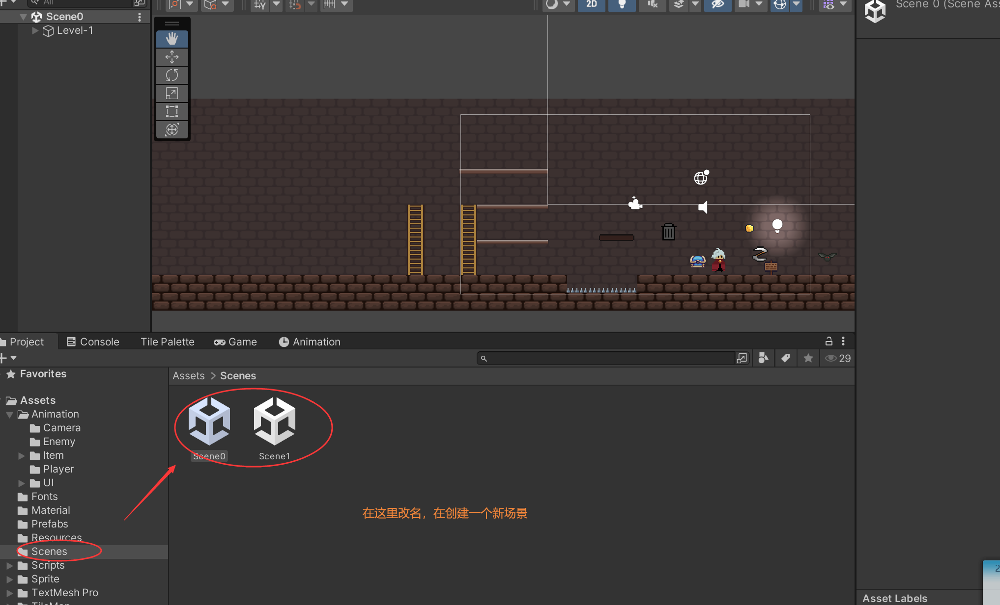
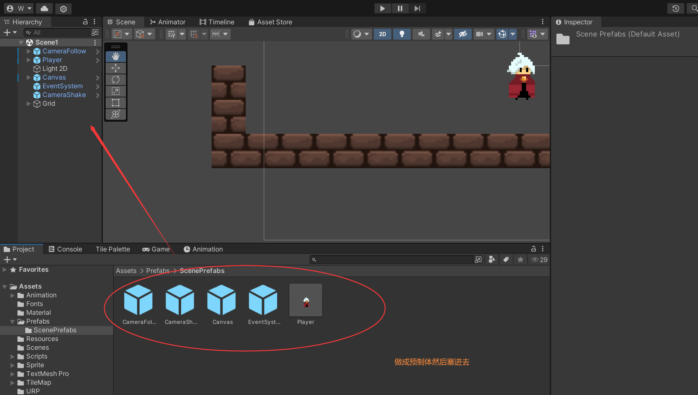
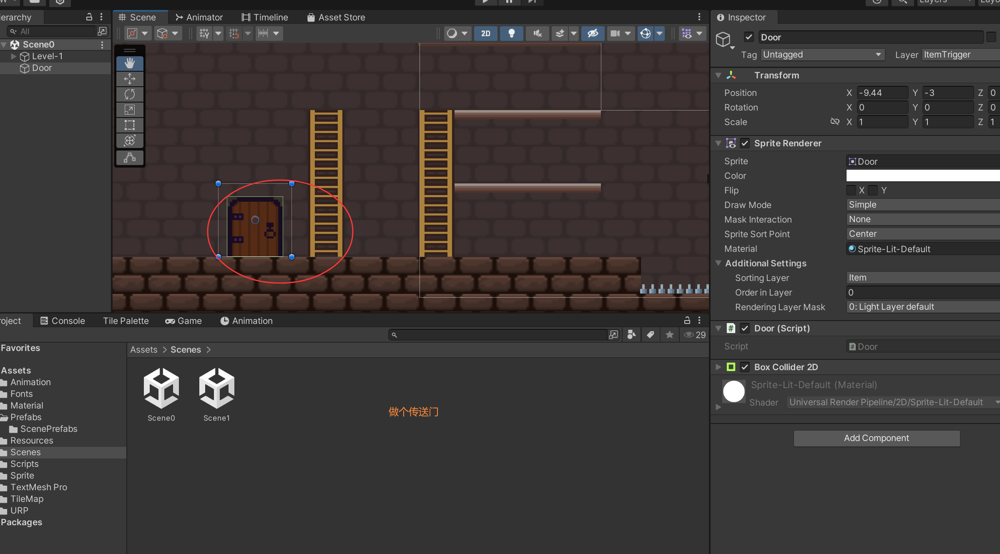

# 切换关卡








```c#

public class Door : MonoBehaviour
{


    private void OnTriggerEnter2D(Collider2D collision)
    {

        if (collision.CompareTag("Player") &&
            collision.GetType().ToString() == "UnityEngine.CapsuleCollider2D")
        {

            SceneManager.LoadScene(1);
			//SceneManager.GetActiveScene().buildIndex + 1
        }
    }

}

```

