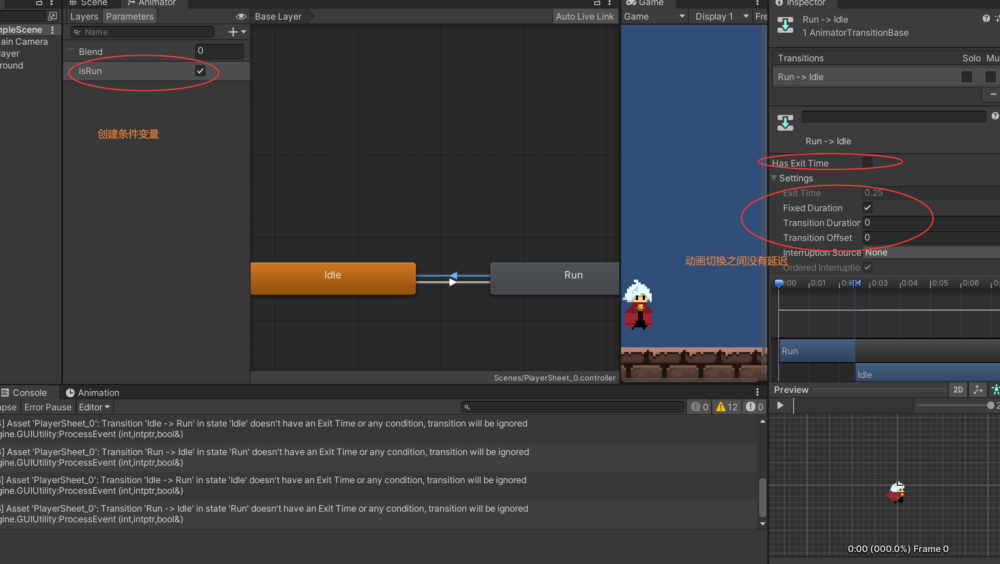

#### 如何在Unity中实现Player移动时Idle和Run动画切换




```c#
public class PlayerController : MonoBehaviour
{
	...
    private Animator animator;
    private float eps = Mathf.Epsilon;

    void Start()
    {
		...
        animator = GetComponent<Animator>();
    }
    
    private void Filp()
    {
        if(rb.velocity.x > eps)
        {
            transform.localRotation = Quaternion.Euler(0, 0, 0);
        }
        if(rb.velocity.x < -eps)
        {
            transform.localRotation = Quaternion.Euler(0, 180, 0);
        }
    }

    //角色移动
    private void Run()
    {
		...
        bool isRun = false;
        if(Mathf.Abs(playerVel.x) > eps)
        {
            isRun = true;
        }
        animator.SetBool("isRun", isRun);
 		...
    }


    void FixedUpdate()
    {
        Run();
        Filp();

    }
}
```

