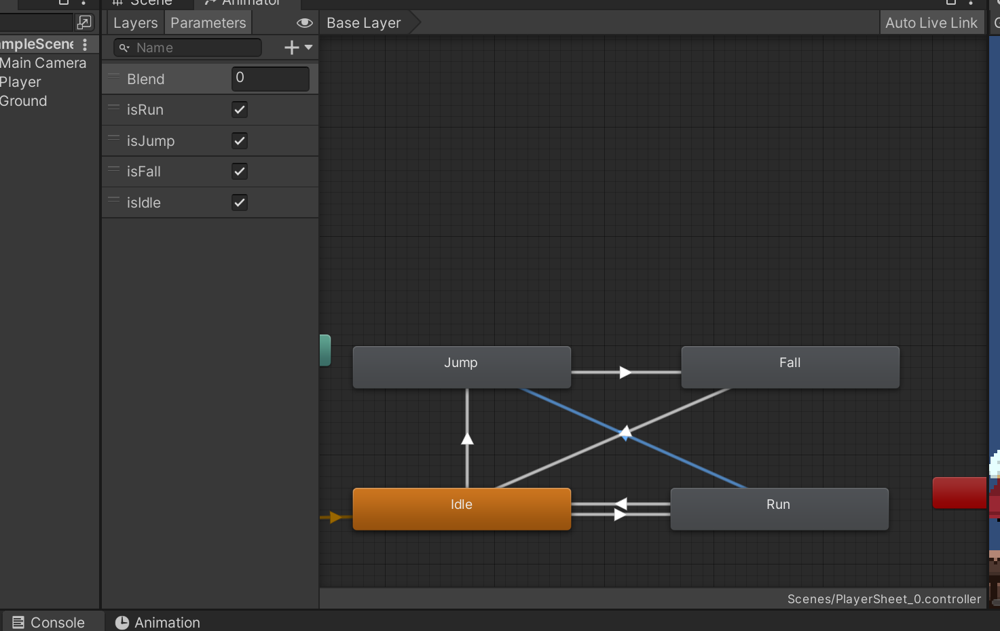

### Player移动跳跃时Jump, Fall, Idle, Run动画切换



```c#

public class PlayerController : MonoBehaviour
{
	...
	private bool isGround = true;
	
    //检测是否触地
    private void CheckIsGround()
    {
        isGround = feetColllider.IsTouchingLayers(LayerMask.GetMask("Ground"));
        //if (isGround) animator.SetBool("isJump", false);
    }

    //跳跃
    private void Jump()
    {
        if (Input.GetButtonDown("Jump"))
        {
            if (isGround)
            {
                animator.SetBool("isJump", true);
				...
            }
        }
    }

    // 切换动画
    private void SwitchAnimation()
    {
        animator.SetBool("isIdle", false);
        if (animator.GetBool("isJump"))
        {
            if(rb.velocity.y < -eps)
            {
                animator.SetBool("isJump", false);
                animator.SetBool("isFall", true);
            }
        }
        if (isGround)
        {
            animator.SetBool("isIdle", true);
            animator.SetBool("isFall", false);
        }
    }

    void Update()
    {
		...
        CheckIsGround();
        SwitchAnimation();
    }
}

```

