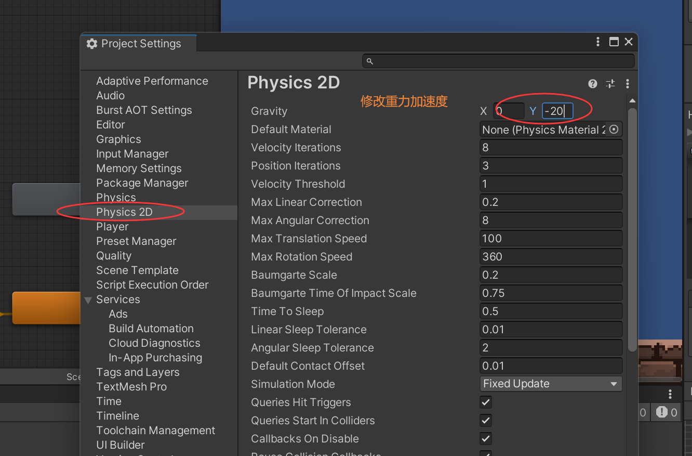

### Player二段跳跃Double Jump





```c#

public class PlayerController : MonoBehaviour
{
	...
   	[SerializeField]
    private float jumpSpeed2 = 8; //二段跳速度
    private bool canDoubleJump = true;
	
	...

    //检测是否触地
    private void CheckIsGround()
    {
		..
        if(isGround) canDoubleJump = true;
    }

    //跳跃
    private void Jump()
    {
        if (Input.GetButtonDown("Jump"))
        {
            if (isGround)
            {
                animator.SetBool("isJump", true);
                Vector2 jumpVel = new Vector2(0f, jumpSpeed);
                rb.velocity = Vector2.up * jumpVel;
            }else if (canDoubleJump)//二段跳
            {
                canDoubleJump = false;
                animator.SetBool("isJump", true);
                Vector2 jumpVel = new Vector2(0f, jumpSpeed2);
                rb.velocity = Vector2.up * jumpVel;
            }
        }
    }

}

```

