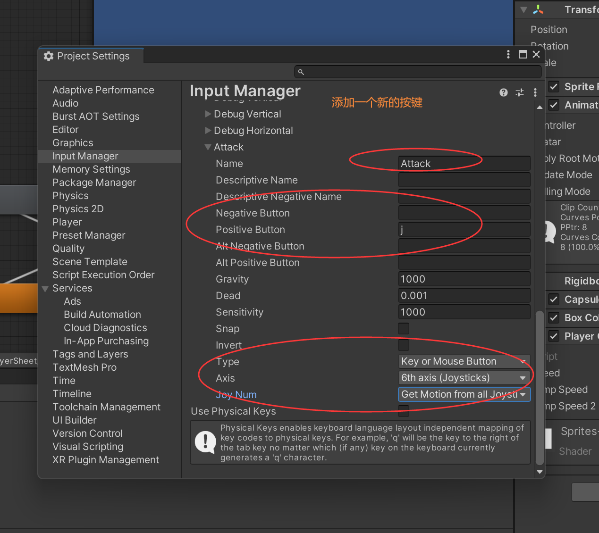
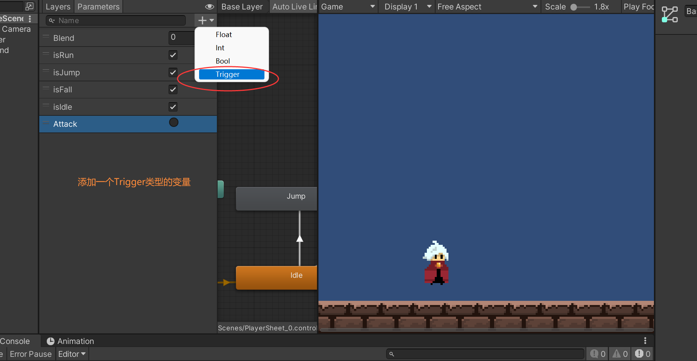
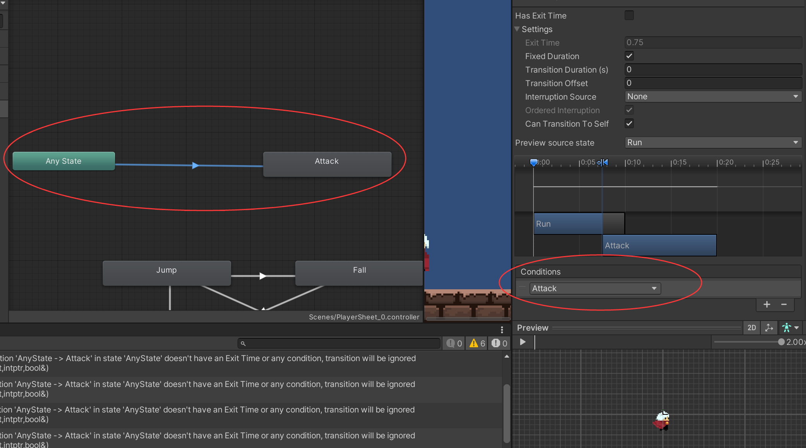
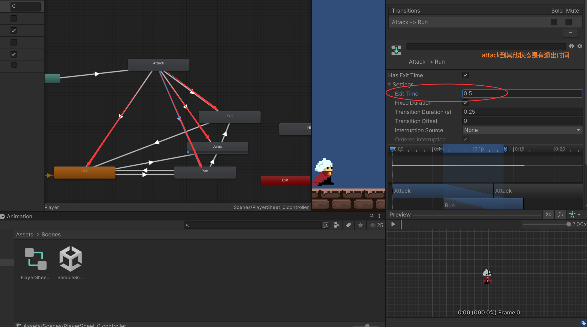
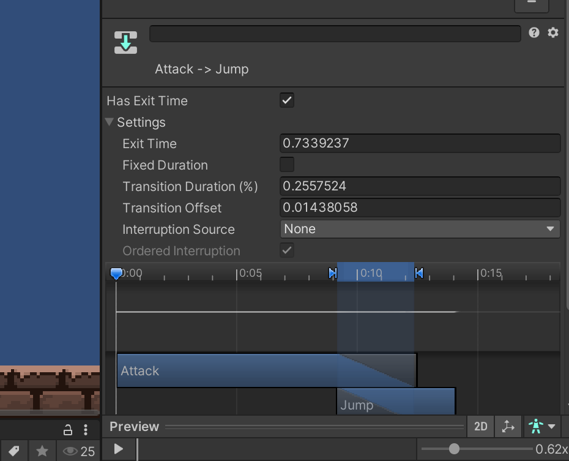

### 实现人物攻击Player Attack（动画篇）



	







```
public class PlayerController : MonoBehaviour
{
	...

    //攻击
    private void Attack()
    {
        if (Input.GetButtonDown("Attack"))
        {
            animator.SetTrigger("Attack");
        }
    }

    void Update()
    {
		...
        Attack();
    }
}

```

补： 注意让attack到其他状态都把动画播完

