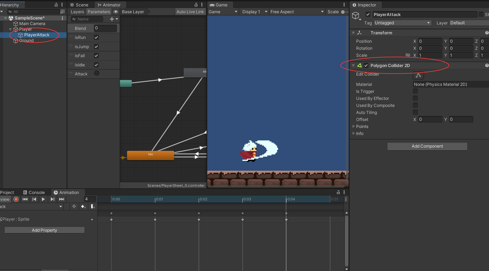
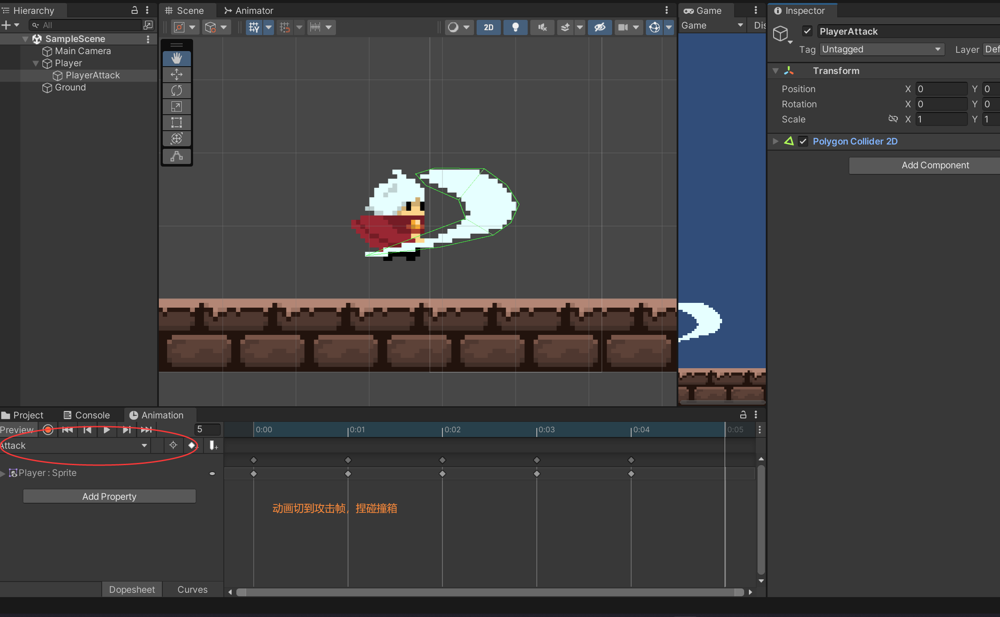
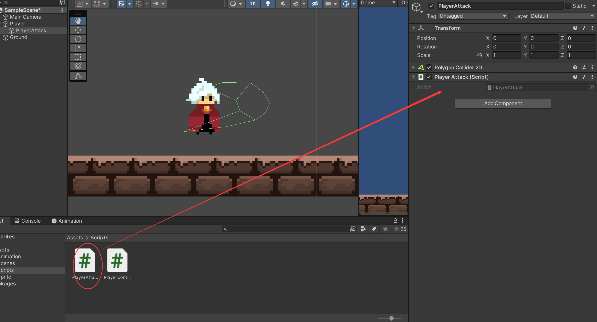
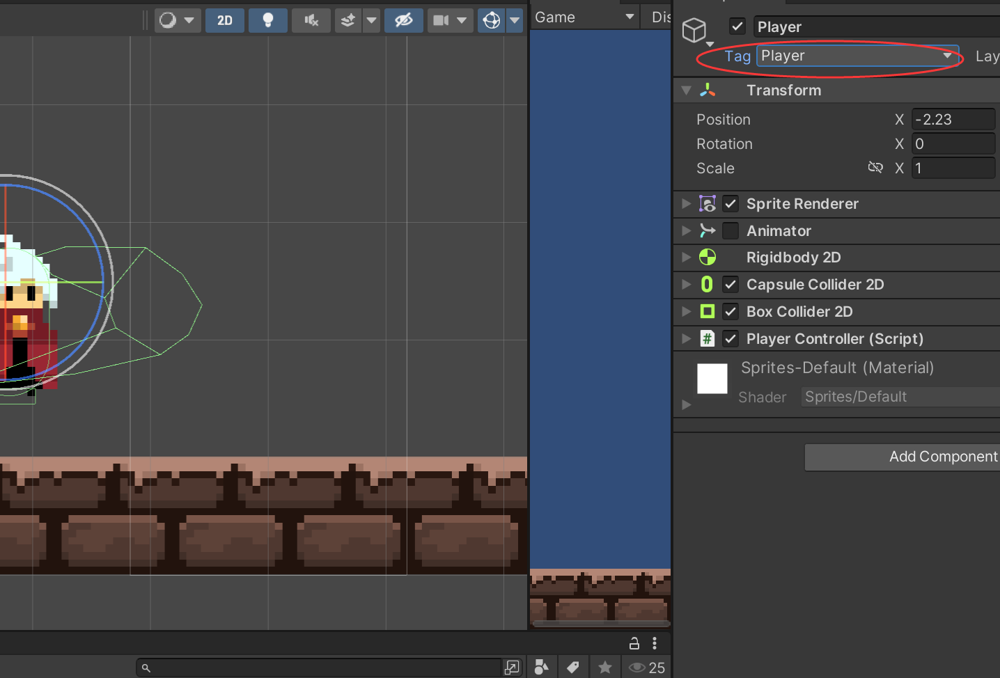

### 人物攻击Player Attack（Hitbox篇）









```c#
public class PlayerAttack : MonoBehaviour
{
    [SerializeField]
    private int damage;
    [SerializeField]
    private float preDelayTime;

    [SerializeField]
    private float attackTime;

    private Animator animator;
    private PolygonCollider2D col;

    void Start()
    {
        //animator = GameObject.FindGameObjectWithTag("Player").GetComponent<Animator>();
        animator = GetComponentInParent<Animator>();
        col = GetComponent<PolygonCollider2D>();
    }

    //攻击
    private void Attack()
    {
        if (Input.GetButtonDown("Attack"))
        {
            animator.SetTrigger("Attack");
            StartCoroutine(DelayAttack());


            //print(animator);
        }
    }
    IEnumerator DelayAttack()
    {
        yield return new WaitForSeconds(preDelayTime);
        col.enabled = true;
        StartCoroutine(disableHitBox());
    }


    IEnumerator disableHitBox()
    {
        yield return new WaitForSeconds(attackTime);
        col.enabled = false;   

    }


    // Update is called once per frame
    void Update()
    {
        Attack();
    }
}

```

后续考虑融合树